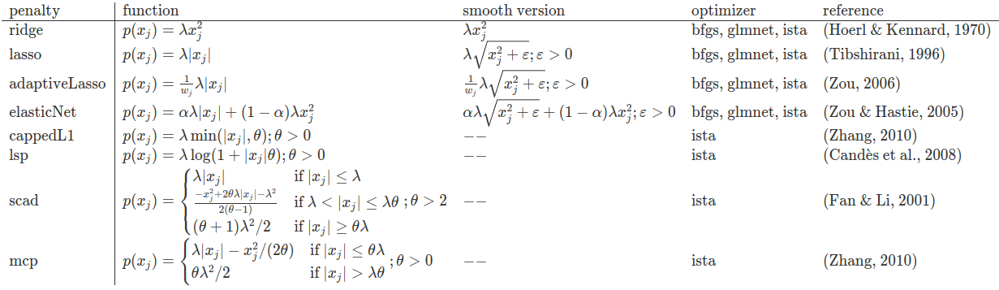

<!-- README.md is generated from README.Rmd. Please edit that file -->

# lessSEM

lessSEM (**l**essSEM **es**timates **s**parse **SEM**) is an R package
which provides regularized structural equation modeling (regularized
SEM) with non-smooth penalty functions (e.g., lasso) building on
[lavaan](https://github.com/yrosseel/lavaan). lessSEM is heavily
inspired by the [regsem](https://github.com/Rjacobucci/regsem) package
and the [lslx](https://github.com/psyphh/lslx) package which provide
similar functionality.

The objectives of lessSEM are:

1.  to compare exact and approximate optimization of regularized SEM
2.  to provide optimizers for other SEM packages which can be used with
    an interface similar to optim

**Warning**: The package is relatively new and you may find more stable
implementations of regularized SEM in the more mature R packages
[regsem](https://github.com/Rjacobucci/regsem) and
[lslx](https://github.com/psyphh/lslx). Finally, you may want to check
out the julia package
[StructuralEquationModels.jl](https://github.com/StructuralEquationModels/StructuralEquationModels.jl).
They provide a more flexible implementation of (regularized) SEM with
very interesting penalty functions.

The following penalty functions are currently implemented in lessSEM:

“penalty” refers to the name of the function call in the lessSEM package
(e.g., lasso is called with the `lasso()` function). Smooth functions
are called with `smoothLasso`, `smoothAdaptiveLasso`, and
`smoothElasticNet`. These are only implemented for the comparison of
exact and approximate optimization and should not be used in most cases.
The best model can be selected with the AIC, or BIC. If you want to use
cross-validation instead, use `cvLasso`, `cvAdaptiveLasso`, etc. instead
(see, e.g., `?lessSEM::cvLasso`). The smooth versions are called
`cvSmoothLasso`, etc.

Currently, lessSEM has the following optimizers:

-   (variants of) iterative shrinkage and thresholding (e.g., Beck &
    Teboulle, 2009; Gong et al., 2013; Parikh & Boyd, 2013);
    optimization of cappedL1, lsp, scad, and mcp is based on Gong et
    al. (2013)
-   glmnet (Friedman et al., 2010; Yuan et al., 2012; Huang, 2020)

**These are also available for other packages.** There are three ways to
implement them which are documented in the
`General-Purpose-Optimization` vignette. In short, these are:

1.  using the R interface: All general purpose implementations of the
    functions are called with prefix “gp” (`gpLasso`, `gpScad`, …). More
    information and examples can be found in the documentation of these
    functions (e.g., `?lessSEM::gpLasso`, `?lessSEM::gpAdaptiveLasso`,
    `?lessSEM::gpElasticNet`). The interface is similar to the optim
    optimizers in R.
2.  using Rcpp, we can pass C++ function pointers to the general purpose
    optimizers `gpLassoCpp`, `gpScadCpp`, … (e.g.,
    `?lessSEM::gpLassoCpp`)
3.  All optimizers are implemented as C++ header-only files in lessSEM.
    Thus, they can be accessed from other packages using C++. The
    interface is similar to that of the
    [ensmallen](https://ensmallen.org/) library. We have implemented a
    simple example for elastic net regularization of linear regressions
    in the [lessLM](https://github.com/jhorzek/lessLM) package. You can
    also find more details on the general design of the optimizer
    interface in the vignette `The-optimizer-interface`

Similar to [regsem](https://github.com/Rjacobucci/regsem), lessSEM is
specified using a model built in
[lavaan](https://github.com/yrosseel/lavaan). lessSEM can handle missing
data by means of full information maximum likelihood estimation and
allows for equality constraints on parameters. However,
[regsem](https://github.com/Rjacobucci/regsem) and
[lslx](https://github.com/psyphh/lslx) offer even more features, such as
multi-group penalties.

# Installation

If you want to install lessSEM from GitHub, use the following commands
in R:

    if(!require(devtools))install.packages("devtools")

    devtools::install_github("jhorzek/lessSEM")

# Example

    library(lessSEM)

    # Identical to regsem, lessSEM builds on the lavaan
    # package for model specification. The first step
    # therefore is to implement the model in lavaan.

    dataset <- simulateExampleData()

    lavaanSyntax <- "
      f =~ l1*y1 + l2*y2 + l3*y3 + l4*y4 + l5*y5 + 
           l6*y6 + l7*y7 + l8*y8 + l9*y9 + l10*y10 + 
           l11*y11 + l12*y12 + l13*y13 + l14*y14 + l15*y15
      f ~~ 1*f
      "

    lavaanModel <- lavaan::sem(lavaanSyntax,
                               data = dataset,
                               meanstructure = TRUE,
                               std.lv = TRUE)

    # Optional: Plot the model
    # semPlot::semPaths(lavaanModel, 
    #                   what = "est",
    #                   fade = FALSE)

    regsem <- lasso(
      # pass the fitted lavaan model
      lavaanModel = lavaanModel,
      # names of the regularized parameters:
      regularized = paste0("l", 6:15),
      # in case of lasso and adaptive lasso, we can specify the number of lambda
      # values to use. lessSEM will automatically find lambda_max and fit
      # models for nLambda values between 0 and lambda_max. For the other
      # penalty functions, lambdas must be specified explicitly
      nLambdas = 50)

    # use the plot-function to plot the regularized parameters:
    plot(regsem)

    # elements of regsem can be accessed with the @ operator:
    regsem@parameters[1,]

    # AIC and BIC:
    AIC(regsem)
    BIC(regsem)

    # The best parameters can also be extracted with:
    coef(regsem, criterion = "AIC")
    coef(regsem, criterion = "BIC")

    # cross-validation
    cv <- cvLasso(lavaanModel = lavaanModel,
                  regularized = paste0("l", 6:15),
                  lambdas = seq(0,1,.1),
                  standardize = TRUE)

    # get best model according to cross-validation:
    coef(cv)

    #### Advanced ###
    # Switching the optimizer # 
    # Use the "method" argument to switch the optimizer. The control argument
    # must also be changed to the corresponding function:
    regsemGlmnet <- lasso(
      lavaanModel = lavaanModel,
      regularized = paste0("l", 6:15),
      nLambdas = 50,
      method = "glmnet",
      control = controlGlmnet())

    # Note: The results are basically identical:
    regsemGlmnet@parameters - regsem@parameters

# A more thorough introduction

You will find a short introduction to regularized SEM with the lessSEM
package in the vignette “lessSEM” (see
`vignette('lessSEM', package = 'lessSEM')`). More information is also
provided in the documentation of the individual functions (e.g., see
`?lessSEM::scad`)

# Miscellaneous

You will find a short introduction to the optimizer interfaces in the
vignette  
`vignette('The-optimizer-interface', package = 'lessSEM')` and a
derivation of the scad and mcp used by the package in the vignette
`vignette('SCAD-and-MCP', package = 'lessSEM')`.

Finally, you can also transform parameters of your model. This is
explained in detail in the vignette
`vignette('Parameter-transformations', package = 'lessSEM')` and is a
powerful tool to, for instance, detect measurement invariance.

# References

## R - Packages / Software

-   [lavaan](https://github.com/yrosseel/lavaan) Rosseel, Y. (2012).
    lavaan: An R Package for Structural Equation Modeling. Journal of
    Statistical Software, 48(2), 1–36.
    <https://doi.org/10.18637/jss.v048.i02>
-   [regsem](https://github.com/Rjacobucci/regsem): Jacobucci, R.
    (2017). regsem: Regularized Structural Equation Modeling.
    ArXiv:1703.08489 \[Stat\]. <http://arxiv.org/abs/1703.08489>
-   [lslx](https://github.com/psyphh/lslx): Huang, P.-H. (2020). lslx:
    Semi-confirmatory structural equation modeling via penalized
    likelihood. Journal of Statistical Software, 93(7).
    <https://doi.org/10.18637/jss.v093.i07>
-   [fasta](https://cran.r-project.org/web/packages/fasta/index.html):
    Another implementation of the fista algorithm (Beck & Teboulle,
    2009).
-   [ensmallen](https://ensmallen.org/): Curtin, R. R., Edel, M.,
    Prabhu, R. G., Basak, S., Lou, Z., & Sanderson, C. (2021). The
    ensmallen library for flexible numerical optimization. Journal of
    Machine Learning Research, 22, 1–6.

## Regularized Structural Equation Modeling

-   Huang, P.-H., Chen, H., & Weng, L.-J. (2017). A Penalized Likelihood
    Method for Structural Equation Modeling. Psychometrika, 82(2),
    329–354. <https://doi.org/10.1007/s11336-017-9566-9>
-   Jacobucci, R., Grimm, K. J., & McArdle, J. J. (2016). Regularized
    Structural Equation Modeling. Structural Equation Modeling: A
    Multidisciplinary Journal, 23(4), 555–566.
    <https://doi.org/10.1080/10705511.2016.1154793>

## Penalty Functions

-   Candès, E. J., Wakin, M. B., & Boyd, S. P. (2008). Enhancing
    Sparsity by Reweighted l1 Minimization. Journal of Fourier Analysis
    and Applications, 14(5–6), 877–905.
    <https://doi.org/10.1007/s00041-008-9045-x>
-   Fan, J., & Li, R. (2001). Variable selection via nonconcave
    penalized likelihood and its oracle properties. Journal of the
    American Statistical Association, 96(456), 1348–1360.
    <https://doi.org/10.1198/016214501753382273>
-   Hoerl, A. E., & Kennard, R. W. (1970). Ridge Regression: Biased
    Estimation for Nonorthogonal Problems. Technometrics, 12(1), 55–67.
    <https://doi.org/10.1080/00401706.1970.10488634>
-   Tibshirani, R. (1996). Regression shrinkage and selection via the
    lasso. Journal of the Royal Statistical Society. Series B
    (Methodological), 58(1), 267–288.
-   Zhang, C.-H. (2010). Nearly unbiased variable selection under
    minimax concave penalty. The Annals of Statistics, 38(2), 894–942.
    <https://doi.org/10.1214/09-AOS729>
-   Zhang, T. (2010). Analysis of Multi-stage Convex Relaxation for
    Sparse Regularization. Journal of Machine Learning Research, 11,
    1081–1107.
-   Zou, H. (2006). The adaptive lasso and its oracle properties.
    Journal of the American Statistical Association, 101(476),
    1418–1429. <https://doi.org/10.1198/016214506000000735>
-   Zou, H., & Hastie, T. (2005). Regularization and variable selection
    via the elastic net. Journal of the Royal Statistical Society:
    Series B, 67(2), 301–320.
    <https://doi.org/10.1111/j.1467-9868.2005.00503.x>

## Optimizer

### GLMNET

-   Friedman, J., Hastie, T., & Tibshirani, R. (2010). Regularization
    paths for generalized linear models via coordinate descent. Journal
    of Statistical Software, 33(1), 1–20.
    <https://doi.org/10.18637/jss.v033.i01>
-   Yuan, G.-X., Ho, C.-H., & Lin, C.-J. (2012). An improved GLMNET for
    l1-regularized logistic regression. The Journal of Machine Learning
    Research, 13, 1999–2030. <https://doi.org/10.1145/2020408.2020421>

### Variants of ISTA

-   Beck, A., & Teboulle, M. (2009). A Fast Iterative
    Shrinkage-Thresholding Algorithm for Linear Inverse Problems. SIAM
    Journal on Imaging Sciences, 2(1), 183–202.
    <https://doi.org/10.1137/080716542>
-   Gong, P., Zhang, C., Lu, Z., Huang, J., & Ye, J. (2013). A general
    iterative shrinkage and thresholding algorithm for non-convex
    regularized optimization problems. Proceedings of the 30th
    International Conference on Machine Learning, 28(2)(2), 37–45.
-   Parikh, N., & Boyd, S. (2013). Proximal Algorithms. Foundations and
    Trends in Optimization, 1(3), 123–231.

# Important Notes

THE SOFTWARE IS PROVIDED ‘AS IS’, WITHOUT WARRANTY OF ANY KIND, EXPRESS
OR IMPLIED, INCLUDING BUT NOT LIMITED TO THE WARRANTIES OF
MERCHANTABILITY, FITNESS FOR A PARTICULAR PURPOSE AND NONINFRINGEMENT.
IN NO EVENT SHALL THE AUTHORS OR COPYRIGHT HOLDERS BE LIABLE FOR ANY
CLAIM, DAMAGES OR OTHER LIABILITY, WHETHER IN AN ACTION OF CONTRACT,
TORT OR OTHERWISE, ARISING FROM, OUT OF OR IN CONNECTION WITH THE
SOFTWARE OR THE USE OR OTHER DEALINGS IN THE SOFTWARE.
