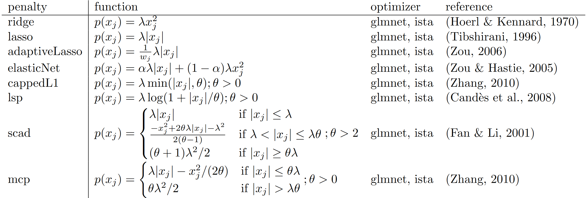

<!-- README.md is generated from README.Rmd. Please edit that file -->

# lessSEM 

<!-- badges: start -->

[](https://cranlogs.r-pkg.org/badges/grand-total/lessSEM)
<!-- badges: end -->

**lessSEM** (**l**essSEM **es**timates **s**parse **SEM**) is an R
package for regularized structural equation modeling (regularized SEM)
with non-smooth penalty functions (e.g., lasso) building on
[**lavaan**](https://github.com/yrosseel/lavaan). **lessSEM** is heavily
inspired by the [**regsem**](https://github.com/Rjacobucci/regsem)
package and the [**lslx**](https://github.com/psyphh/lslx) packages that
have similar functionality. **If you use lessSEM, please also cite
[regsem](https://github.com/Rjacobucci/regsem) and and
[lslx](https://github.com/psyphh/lslx)!**

The objectives of **lessSEM** are to provide …

1.  a flexible framework for regularizing SEM.
2.  optimizers for other packages that can handle non-differentiable
    penalty functions.

The following penalty functions are currently implemented in
**lessSEM**:



The column “penalty” refers to the name of the function call in the
**lessSEM** package (e.g., lasso is called with the `lasso()` function).

The best model can be selected with the AIC or BIC. If you want to use
cross-validation, use `cvLasso`, `cvAdaptiveLasso`, etc. instead (see,
e.g., `?lessSEM::cvLasso`).

## [**regsem**](https://github.com/Rjacobucci/regsem), [**lslx**](https://github.com/psyphh/lslx), and **lessSEM**

The packages [**regsem**](https://github.com/Rjacobucci/regsem),
[**lslx**](https://github.com/psyphh/lslx), and **lessSEM** can all be
used to regularize basic SEM. In fact, as outlined above, **lessSEM** is
heavily inspired by [**regsem**](https://github.com/Rjacobucci/regsem)
and [**lslx**](https://github.com/psyphh/lslx). However, the packages
differ in their targets: The objective of **lessSEM** is not to replace
the more mature packages
[**regsem**](https://github.com/Rjacobucci/regsem) and
[**lslx**](https://github.com/psyphh/lslx). Instead, our objective is to
provide method developers with a flexible framework for regularized SEM.
The following shows an incomplete comparison of some features
implemented in the three packages:

|                               | **regsem**      | **lslx**            | **lessSEM**     |
|-------------------------------|-----------------|---------------------|-----------------|
| Model specification           | based on lavaan | similar to lavaan   | based on lavaan |
| Maximum likelihood estimation | Yes             | Yes                 | Yes             |
| Least squares estimation      | No              | Yes                 | Dev.            |
| Categorical variables         | No              | Yes                 | No              |
| Confidence Intervals          | No              | Yes                 | No              |
| Missing Data                  | FIML            | Auxiliary Variables | FIML            |
| Multi-group models            | No              | Yes                 | Yes             |
| Stability selection           | Yes             | No                  | Dev.            |
| Mixed penalties               | No              | No                  | Yes             |
| Equality constraints          | Yes             | No                  | Yes             |
| Parameter transformations     | diff_lasso      | No                  | Yes             |
| Definition variables          | No              | No                  | Yes             |

> **Warning** Dev. refers to features that are supported, but still
> under development and may have bugs. Use with caution!

# Installation

If you want to install **lessSEM** from CRAN, use the following commands
in R:

``` r
install.packages("lessSEM")
```

The newest version of the package can be installed from GitHub. However,
because the project uses submodules, `devtools::install_github` does not
download the entire R package. To download the development version, the
following command needs to be run in git:

    git clone --branch development --recurse-submodules https://github.com/jhorzek/lessSEM.git

Navigate to the folder to which git copied the project and install the
package with the lessSEM.Rproj file.

If you want to download the main branch, use

    git clone --recurse-submodules https://github.com/jhorzek/lessSEM.git

> **Note** The lessSEM project has multiple branches. The **main**
> branch will match the version currently available from CRAN. The
> **development** branch will have newer features not yet available from
> CRAN. This branch will have passed all current tests of our test
> suite, but may not be ready for CRAN yet (e.g., because not all
> objectives of the road map have been met). **gh-pages** is used to
> create the [documentation
> website](https://jhorzek.github.io/lessSEM/). Finally, all other
> branches are used for ongoing development and should be considered
> unstable.

# Introduction

Please visit the [lessSEM website](https://jhorzek.github.io/lessSEM/)
for the latest documentation. You will also find a short introduction to
regularized SEM in `vignette('lessSEM', package = 'lessSEM')`and the
documentation of the individual functions (e.g., see `?lessSEM::scad`).
Finally, you will find templates for a selection of models that can be
used with **lessSEM** (e.g., the cross-lagged panel model) in the
package [**lessTemplates**](https://github.com/jhorzek/lessTemplates).

# Example

``` r
library(lessSEM)
library(lavaan)

# Identical to regsem, lessSEM builds on the lavaan
# package for model specification. The first step
# therefore is to implement the model in lavaan.

dataset <- simulateExampleData()

lavaanSyntax <- "
      f =~ l1*y1 + l2*y2 + l3*y3 + l4*y4 + l5*y5 + 
           l6*y6 + l7*y7 + l8*y8 + l9*y9 + l10*y10 + 
           l11*y11 + l12*y12 + l13*y13 + l14*y14 + l15*y15
      f ~~ 1*f
      "

lavaanModel <- lavaan::sem(lavaanSyntax,
                           data = dataset,
                           meanstructure = TRUE,
                           std.lv = TRUE)

# Optional: Plot the model
# if(!require("semPlot")) install.packages("semPlot")
# semPlot::semPaths(lavaanModel, 
#                   what = "est",
#                   fade = FALSE)

lsem <- lasso(
  # pass the fitted lavaan model
  lavaanModel = lavaanModel,
  # names of the regularized parameters:
  regularized = c("l6", "l7", "l8", "l9", "l10",
                  "l11", "l12", "l13", "l14", "l15"),
  # in case of lasso and adaptive lasso, we can specify the number of lambda
  # values to use. lessSEM will automatically find lambda_max and fit
  # models for nLambda values between 0 and lambda_max. For the other
  # penalty functions, lambdas must be specified explicitly
  nLambdas = 50)

# use the plot-function to plot the regularized parameters:
plot(lsem)

# use the coef-function to show the estimates
coef(lsem)

# the best parameters can be extracted with:
coef(lsem, criterion = "AIC")
coef(lsem, criterion = "BIC")

# if you just want the estimates, use estimates():
estimates(lsem, criterion = "AIC")

# elements of lsem can be accessed with the @ operator:
lsem@parameters[1,]

# AIC and BIC for all tuning parameter configurations:
AIC(lsem)
BIC(lsem)

# cross-validation
cv <- cvLasso(lavaanModel = lavaanModel,
              regularized = c("l6", "l7", "l8", "l9", "l10",
                              "l11", "l12", "l13", "l14", "l15"),
              lambdas = seq(0,1,.1),
              standardize = TRUE)

# get best model according to cross-validation:
coef(cv)

#### Advanced ####
# Switching the optimizer:
# Use the "method" argument to switch the optimizer. The control argument
# must also be changed to the corresponding function:
lsemIsta <- lasso(
  lavaanModel = lavaanModel,
  regularized = paste0("l", 6:15),
  nLambdas = 50,
  method = "ista",
  control = controlIsta(
    # Here, we can also specify that we want to use multiple cores:
    nCores = 2))

# Note: The results are basically identical:
lsemIsta@parameters - lsem@parameters
```

If you want to regularize all loadings, regressions, variances, or
covariances, you can also use one of the helper functions to extract the
respective parameter labels from **lavaan** and then pass these to
**lessSEM**:

``` r
loadings(lavaanModel)
#>  [1] "l1"  "l2"  "l3"  "l4"  "l5"  "l6"  "l7"  "l8"  "l9"  "l10" "l11" "l12"
#> [13] "l13" "l14" "l15"
regressions(lavaanModel)
#> character(0)
variances(lavaanModel)
#>  [1] "y1~~y1"   "y2~~y2"   "y3~~y3"   "y4~~y4"   "y5~~y5"   "y6~~y6"  
#>  [7] "y7~~y7"   "y8~~y8"   "y9~~y9"   "y10~~y10" "y11~~y11" "y12~~y12"
#> [13] "y13~~y13" "y14~~y14" "y15~~y15"
covariances(lavaanModel)
#> character(0)
```

# Transformations

**lessSEM** allows for parameter transformations that could, for
instance, be used to test measurement invariance in longitudinal models
(e.g., Liang, 2018; Bauer et al., 2020). A thorough introduction is
provided in
`vignette('Parameter-transformations', package = 'lessSEM')`. As an
example, we will test measurement invariance in the `PoliticalDemocracy`
data set.

``` r
library(lessSEM)
library(lavaan)
# we will use the PoliticalDemocracy from lavaan (see ?lavaan::sem)
model <- ' 
  # latent variable definitions
     ind60 =~ x1 + x2 + x3
     # assuming different loadings for different time points:
     dem60 =~ y1 + a1*y2 + b1*y3 + c1*y4
     dem65 =~ y5 + a2*y6 + b2*y7 + c2*y8

  # regressions
    dem60 ~ ind60
    dem65 ~ ind60 + dem60

  # residual correlations
    y1 ~~ y5
    y2 ~~ y4 + y6
    y3 ~~ y7
    y4 ~~ y8
    y6 ~~ y8
'

fit <- sem(model, data = PoliticalDemocracy)

# We will define a transformation which regularizes differences
# between loadings over time:

transformations <- "
// which parameters do we want to use?
parameters: a1, a2, b1, b2, c1, c2, delta_a2, delta_b2, delta_c2

// transformations:
a2 = a1 + delta_a2;
b2 = b1 + delta_b2;
c2 = c1 + delta_c2;
"

# setting delta_a2, delta_b2, or delta_c2 to zero implies measurement invariance
# for the respective parameters (a1, b1, c1)
lassoFit <- lasso(lavaanModel = fit, 
                  # we want to regularize the differences between the parameters
                  regularized = c("delta_a2", "delta_b2", "delta_c2"),
                  nLambdas = 100,
                  # Our model modification must make use of the modifyModel - function:
                  modifyModel = modifyModel(transformations = transformations)
)
```

Finally, we can extract the best parameters:

``` r
coef(lassoFit, criterion = "BIC")
```

As all differences (`delta_a2`, `delta_b2`, and `delta_c2`) have been
zeroed, we can assume measurement invariance.

# Experimental Features

The following features are relatively new and you may still experience
some bugs. Please be aware of that when using these features.

## From **lessSEM** to **lavaan**

**lessSEM** supports exporting specific models to **lavaan**. This can
be very useful when plotting the final model.

``` r
lavaanModel <- lessSEM2Lavaan(regularizedSEM = lsem, 
                              criterion = "BIC")
```

The result can be plotted with, for instance,
[**semPlot**](https://github.com/SachaEpskamp/semPlot):

``` r
library(semPlot)
semPaths(lavaanModel,
         what = "est",
         fade = FALSE)
```

## Multi-Group Models and Definition Variables

**lessSEM** supports multi-group SEM and, to some degree, definition
variables. Regularized multi-group SEM have been proposed by Huang
(2018) and are implemented in **lslx** (Huang, 2020). Here, differences
between groups are regularized. A detailed introduction can be found in
`vignette(topic = "Definition-Variables-and-Multi-Group-SEM", package = "lessSEM")`.
Therein it is also explained how the multi-group SEM can be used to
implement definition variables (e.g., for latent growth curve models).

## Mixed Penalties

**lessSEM** allows for defining different penalties for different parts
of the model. This feature is new and very experimental. Please keep
that in mind when using the procedure. A detailed introduction can be
found in `vignette(topic = "Mixed-Penalties", package = "lessSEM")`.

To provide a short example, we will regularize the loadings and the
regression parameters of the Political Democracy data set with different
penalties. The following script is adapted from `?lavaan::sem`.

``` r
model <- ' 
  # latent variable definitions
     ind60 =~ x1 + x2 + x3 + c2*y2 + c3*y3 + c4*y4
     dem60 =~ y1 + y2 + y3 + y4
     dem65 =~ y5 + y6 + y7 + c*y8

  # regressions
    dem60 ~ r1*ind60
    dem65 ~ r2*ind60 + r3*dem60
'

lavaanModel <- sem(model,
                   data = PoliticalDemocracy)

# Let's add a lasso penalty on the cross-loadings c2 - c4 and 
# scad penalty on the regressions r1-r3
fitMp <- lavaanModel |>
  mixedPenalty() |>
  addLasso(regularized = c("c2", "c3", "c4"), 
           lambdas = seq(0,1,.1)) |>
  addScad(regularized = c("r1", "r2", "r3"), 
          lambdas = seq(0,1,.2),
          thetas = 3.7) |>
  fit()
```

The best model according to the BIC can be extracted with:

``` r
coef(fitMp, criterion = "BIC")
```

# Optimizers

Currently, **lessSEM** has the following optimizers:

- (variants of) iterative shrinkage and thresholding (e.g., Beck &
  Teboulle, 2009; Gong et al., 2013; Parikh & Boyd, 2013); optimization
  of cappedL1, lsp, scad, and mcp is based on Gong et al. (2013)
- glmnet (Friedman et al., 2010; Yuan et al., 2012; Huang, 2020)

These optimizers are implemented based on the
[**regCtsem**](https://github.com/jhorzek/regCtsem) package. Most
importantly, **all optimizers in lessSEM are available for other
packages.** There are four ways to implement them which are documented
in `vignette("General-Purpose-Optimization", package = "lessSEM")`. In
short, these are:

1.  using the R interface: All general purpose implementations of the
    functions are called with prefix “gp” (`gpLasso`, `gpScad`, …). More
    information and examples can be found in the documentation of these
    functions (e.g., `?lessSEM::gpLasso`, `?lessSEM::gpAdaptiveLasso`,
    `?lessSEM::gpElasticNet`). The interface is similar to the optim
    optimizers in R.
2.  using Rcpp, we can pass C++ function pointers to the general purpose
    optimizers `gpLassoCpp`, `gpScadCpp`, … (e.g.,
    `?lessSEM::gpLassoCpp`)
3.  All optimizers are implemented as C++ header-only files in
    **lessSEM**. Thus, they can be accessed from other packages using
    C++. The interface is similar to that of the
    [**ensmallen**](https://ensmallen.org/) library. We have implemented
    a simple example for elastic net regularization of linear
    regressions in the [**lessLM**](https://github.com/jhorzek/lessLM)
    package. You can also find more details on the general design of the
    optimizer interface in
    `vignette("The-optimizer-interface", package = "lessSEM")`.
4.  The optimizers are implemented in the separate C++ header only
    library [lesstimate](https://jhorzek.github.io/lesstimate/) that can
    be used as a submodule in R packages.

# References

## R - Packages / Software

- [lavaan](https://github.com/yrosseel/lavaan) Rosseel, Y. (2012).
  lavaan: An R Package for Structural Equation Modeling. Journal of
  Statistical Software, 48(2), 1-36.
  <https://doi.org/10.18637/jss.v048.i02>
- [regsem](https://github.com/Rjacobucci/regsem): Jacobucci, R. (2017).
  regsem: Regularized Structural Equation Modeling. ArXiv:1703.08489
  \[Stat\]. <https://arxiv.org/abs/1703.08489>
- [lslx](https://github.com/psyphh/lslx): Huang, P.-H. (2020). lslx:
  Semi-confirmatory structural equation modeling via penalized
  likelihood. Journal of Statistical Software, 93(7).
  <https://doi.org/10.18637/jss.v093.i07>
- [fasta](https://CRAN.R-project.org/package=fasta): Another
  implementation of the fista algorithm (Beck & Teboulle, 2009).
- [ensmallen](https://ensmallen.org/): Curtin, R. R., Edel, M.,
  Prabhu, R. G., Basak, S., Lou, Z., & Sanderson, C. (2021). The
  ensmallen library for flexible numerical optimization. Journal of
  Machine Learning Research, 22, 1–6.
- [regCtsem](https://github.com/jhorzek/regCtsem): Orzek, J. H., &
  Voelkle, M. C. (in press). Regularized continuous time structural
  equation models: A network perspective. Psychological Methods.

## Regularized Structural Equation Modeling

- Huang, P.-H., Chen, H., & Weng, L.-J. (2017). A Penalized Likelihood
  Method for Structural Equation Modeling. Psychometrika, 82(2),
  329–354. <https://doi.org/10.1007/s11336-017-9566-9>
- Huang, P.-H. (2018). A penalized likelihood method for multi-group
  structural equation modelling. British Journal of Mathematical and
  Statistical Psychology, 71(3), 499–522.
  <https://doi.org/10.1111/bmsp.12130>
- Jacobucci, R., Grimm, K. J., & McArdle, J. J. (2016). Regularized
  Structural Equation Modeling. Structural Equation Modeling: A
  Multidisciplinary Journal, 23(4), 555–566.
  <https://doi.org/10.1080/10705511.2016.1154793>

## Penalty Functions

- Candès, E. J., Wakin, M. B., & Boyd, S. P. (2008). Enhancing Sparsity
  by Reweighted l1 Minimization. Journal of Fourier Analysis and
  Applications, 14(5–6), 877–905.
  <https://doi.org/10.1007/s00041-008-9045-x>
- Fan, J., & Li, R. (2001). Variable selection via nonconcave penalized
  likelihood and its oracle properties. Journal of the American
  Statistical Association, 96(456), 1348–1360.
  <https://doi.org/10.1198/016214501753382273>
- Hoerl, A. E., & Kennard, R. W. (1970). Ridge Regression: Biased
  Estimation for Nonorthogonal Problems. Technometrics, 12(1), 55–67.
  <https://doi.org/10.1080/00401706.1970.10488634>
- Tibshirani, R. (1996). Regression shrinkage and selection via the
  lasso. Journal of the Royal Statistical Society. Series B
  (Methodological), 58(1), 267–288.
- Zhang, C.-H. (2010). Nearly unbiased variable selection under minimax
  concave penalty. The Annals of Statistics, 38(2), 894–942.
  <https://doi.org/10.1214/09-AOS729>
- Zhang, T. (2010). Analysis of Multi-stage Convex Relaxation for Sparse
  Regularization. Journal of Machine Learning Research, 11, 1081–1107.
- Zou, H. (2006). The adaptive lasso and its oracle properties. Journal
  of the American Statistical Association, 101(476), 1418–1429.
  <https://doi.org/10.1198/016214506000000735>
- Zou, H., & Hastie, T. (2005). Regularization and variable selection
  via the elastic net. Journal of the Royal Statistical Society: Series
  B, 67(2), 301–320. <https://doi.org/10.1111/j.1467-9868.2005.00503.x>

## Optimizer

### GLMNET

- Friedman, J., Hastie, T., & Tibshirani, R. (2010). Regularization
  paths for generalized linear models via coordinate descent. Journal of
  Statistical Software, 33(1), 1–20.
  <https://doi.org/10.18637/jss.v033.i01>
- Yuan, G.-X., Ho, C.-H., & Lin, C.-J. (2012). An improved GLMNET for
  l1-regularized logistic regression. The Journal of Machine Learning
  Research, 13, 1999–2030. <https://doi.org/10.1145/2020408.2020421>

### Variants of ISTA

- Beck, A., & Teboulle, M. (2009). A Fast Iterative
  Shrinkage-Thresholding Algorithm for Linear Inverse Problems. SIAM
  Journal on Imaging Sciences, 2(1), 183–202.
  <https://doi.org/10.1137/080716542>
- Gong, P., Zhang, C., Lu, Z., Huang, J., & Ye, J. (2013). A general
  iterative shrinkage and thresholding algorithm for non-convex
  regularized optimization problems. Proceedings of the 30th
  International Conference on Machine Learning, 28(2)(2), 37–45.
- Parikh, N., & Boyd, S. (2013). Proximal Algorithms. Foundations and
  Trends in Optimization, 1(3), 123–231.

## Miscellaneous

- Liang, X., Yang, Y., & Huang, J. (2018). Evaluation of structural
  relationships in autoregressive cross-lagged models under longitudinal
  approximate invariance: A Bayesian analysis. Structural Equation
  Modeling: A Multidisciplinary Journal, 25(4), 558–572.
  <https://doi.org/10.1080/10705511.2017.1410706>
- Bauer, D. J., Belzak, W. C. M., & Cole, V. T. (2020). Simplifying the
  Assessment of Measurement Invariance over Multiple Background
  Variables: Using Regularized Moderated Nonlinear Factor Analysis to
  Detect Differential Item Functioning. Structural Equation Modeling: A
  Multidisciplinary Journal, 27(1), 43–55.
  <https://doi.org/10.1080/10705511.2019.1642754>

# LICENSE NOTE

THE SOFTWARE IS PROVIDED ‘AS IS’, WITHOUT WARRANTY OF ANY KIND, EXPRESS
OR IMPLIED, INCLUDING BUT NOT LIMITED TO THE WARRANTIES OF
MERCHANTABILITY, FITNESS FOR A PARTICULAR PURPOSE AND NONINFRINGEMENT.
IN NO EVENT SHALL THE AUTHORS OR COPYRIGHT HOLDERS BE LIABLE FOR ANY
CLAIM, DAMAGES OR OTHER LIABILITY, WHETHER IN AN ACTION OF CONTRACT,
TORT OR OTHERWISE, ARISING FROM, OUT OF OR IN CONNECTION WITH THE
SOFTWARE OR THE USE OR OTHER DEALINGS IN THE SOFTWARE.
