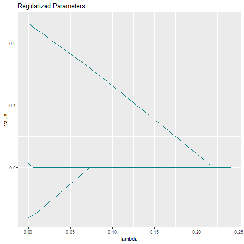
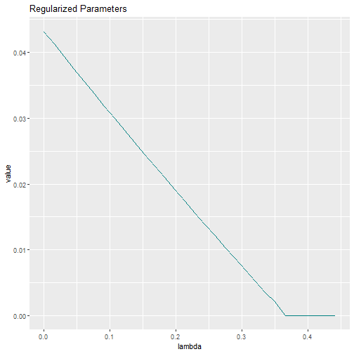

To allow for more flexible model estimation, **lessSEM** offers parameter 
transformations. This is a feature inspired by OpenMx (Neale et al., 2016;
Pritikin et al., 2015; Hunter 2018). Parameter transformations can be very 
powerful and simplify implementing some specific forms of regularization. 

## Motivation

In longitudinal SEM, it is important to investigate if parameters stay the same over
time (e.g., measurement invariance of loadings). This can be difficult to decide and
may require setting up many different models manually. Here, regularization techniques
can be very handy. For instance, in the seminal political democracy example, the 
model is typically set up as follows (see `?lavaan::sem`):


```r
modelSyntax <- ' 
  # latent variable definitions
     ind60 =~ x1 + x2 + x3
     dem60 =~ y1 + a*y2 + b*y3 + c*y4
     dem65 =~ y5 + a*y6 + b*y7 + c*y8

  # regressions
    dem60 ~ ind60
    dem65 ~ ind60 + dem60

  # residual correlations
    y1 ~~ y5
    y2 ~~ y4 
    y3 ~~ y7
    y4 ~~ y8
    y6 ~~ y8
'
```

Note that the loadings a, b, and c are assumed to stay the same over time.
That is, measurement invariance is assumed! Relaxing this assumption, we could
define the model as follows:


```r
modelSyntax <- ' 
  # latent variable definitions
     ind60 =~ x1 + x2 + x3
     dem60 =~ y1 + a1*y2 + b1*y3 + c1*y4
     dem65 =~ y5 + a2*y6 + b2*y7 + c2*y8

  # regressions
    dem60 ~ ind60
    dem65 ~ ind60 + dem60

  # residual correlations
    y1 ~~ y5
    y2 ~~ y4 
    y3 ~~ y7
    y4 ~~ y8
    y6 ~~ y8
'
```

Here, each loading is estimated separately. This results in a more complex model. 
How do we know which model to use? There are many procedures to answer this 
question (e.g., using modification indexes, setting up separate models by hand, etc.).
In the following, we will show how regularization could be used (see e.g., Belzak & Bauer, 2020;
Jacobucci & Grimm, 2018).

## Using Regularization

First, note that measurement invariance can be rephrased as $a_1-a_2 = 0$, $b_1-b_2 = 0$, 
and $c_1-c_2 = 0$. Thus, regularizing the differences between these parameters may
allow for testing measurement invariance (e.g., Belzak & Bauer, 2020; Liang et al., 2018; 
Muthen & Asparouhov, 2013). 
In fact, this is used in Bayesian SEM to test 
approximate measurement invariance (Liang et al., 2018; Muthen & Asparouhov, 2013).
Similar procedures have also been developed by Huang (2018) for multi-group differences
in parameter estimates and by Fisher et al. (2022) in vector autoregressive models.
Furthermore, Jacobucci & Grimm (2018) proposed regularizing differences 
in latent change score models to test equivalence of autoproportion parameters over
time using a two-step procedure. To this end, there they implemented the `diff_lasso`
in **regsem** (Jacobucci et al., 2019). Such a `diff_lasso` is not available in **lessSEM**. 
Instead, **lessSEM** provides a flexible workaround: parameter transformations. 
To make this work, we have to re-define our parameters.

Redefine:

$$
\begin{align}
a_2 &= a_1 + \Delta a_2\\
b_2 &= b_1 + \Delta b_2\\
c_2 &= c_1 + \Delta c_2
\end{align}
$$
By regularizing $\Delta a_2$, $\Delta b_2$, and $\Delta c_2$ towards zero,
we can enforce measurement invariance over time.

## Setting up the Model

We first start with the most flexible model which we want to test:


```r
library(lavaan)
modelSyntax <- ' 
  # latent variable definitions
     ind60 =~ x1 + x2 + x3
     dem60 =~ y1 + a1*y2 + b1*y3 + c1*y4
     dem65 =~ y5 + a2*y6 + b2*y7 + c2*y8

  # regressions
    dem60 ~ ind60
    dem65 ~ ind60 + dem60

  # residual correlations
    y1 ~~ y5
    y2 ~~ y4 
    y3 ~~ y7
    y4 ~~ y8
    y6 ~~ y8
'

lavaanFit <- sem(model = modelSyntax,
                 data = PoliticalDemocracy)
```

Note that the model defined above estimates all parameters time-point specific. 
That is, no measurement invariance is assumed. 

Now, we want to redefine the parameters as outlined above: 

$$
\begin{align}
a_2 &= a_1 + \Delta a_2\\
b_2 &= b_1 + \Delta b_2\\
c_2 &= c_1 + \Delta c_2
\end{align}
$$

In **lessSEM** such redefinitions are called transformations and can be
passed to the penalty functions (e.g., to `lasso`) using the `modifyModel` command.

First, we have to create a definition of our transformations:


```r
transformations <- "
// IMPORTANT: Our transformations always have to start with the follwing line:
parameters: a1, a2, b1, b2, c1, c2, delta_a2, delta_b2, delta_c2

// In the line above, we defined the names of the parameters which we
// want to use in our transformations. EACH AND EVERY PARAMETER USED IN
// THE FOLLOWING MUST BE STATED ABOVE. The line must always start with
// the keyword 'parameters' followed by a colon. The parameters must be
// separated by commata.
// Comments can be added by using double backslash as shown here.

// Now we can state our transformations:

a2 = a1 + delta_a2; // Note: Each declaration must end with a semi-colon!
b2 = b1 + delta_b2;
c2 = c1 + delta_c2;
"
```

Next, we have to pass the `transformations` variable to the penalty function:


```r
lassoFit <- lasso(lavaanModel = lavaanFit, 
                  regularized = c("delta_a2", "delta_b2", "delta_c2"),# we want to regularize 
                  # the differences between the parameters
                  nLambdas = 100,
                  # Our model modification must make use of the modifyModel - function:
                  modifyModel = modifyModel(transformations = transformations)
)
```

Let's have a look at the parameter estimates:


```r
coef(lassoFit)@estimates[seq(1,100,10),c("a1", "b1", "c1", "delta_a2", "delta_b2", "delta_c2")]
#>             a1       b1       c1     delta_a2    delta_b2 delta_c2
#>  [1,] 1.210993 1.167936 1.234011  0.000000000 0.000000000        0
#>  [2,] 1.211114 1.166390 1.234046  0.000000000 0.002702789        0
#>  [3,] 1.212584 1.150753 1.234650  0.000000000 0.030080792        0
#>  [4,] 1.214347 1.135698 1.235563  0.000000000 0.057049529        0
#>  [5,] 1.216419 1.121154 1.236776  0.000000000 0.083716111        0
#>  [6,] 1.218762 1.107040 1.238259  0.000000000 0.110187427        0
#>  [7,] 1.221414 1.093407 1.240046  0.000000000 0.136498978        0
#>  [8,] 1.226629 1.080063 1.242051 -0.003960392 0.162516933        0
#>  [9,] 1.246435 1.067714 1.244329 -0.032144145 0.186302860        0
#> [10,] 1.266524 1.055803 1.247136 -0.060258715 0.210141745        0
```
Note that the differences between the parameters get smaller with larger $\lambda$ values. 
We can also plot the differences:


```r
plot(lassoFit)
```



To check if measurement invariance can be assumed, we can select the best model 
using information criteria:


```r
coef(lassoFit, criterion = "BIC")
#>                                                                                                                              
#>   Tuning         ||--||  Estimates                                                                                           
#>  ------- ------- ||--|| ---------- ---------- ---------- ---------- ---------- ----------- ----------- ----------- ----------
#>   lambda   alpha ||--||  ind60=~x2  ind60=~x3         a1         b1         c1 dem60~ind60 dem65~ind60 dem65~dem60     y1~~y5
#>  ======= ======= ||--|| ========== ========== ========== ========== ========== =========== =========== =========== ==========
#>   0.2216  1.0000 ||--||     2.1825     1.8189     1.2110     1.1679     1.2340      1.4534      0.5935      0.8659     0.5552
#>                                                                                                                          
#>                                                                                                                          
#>  ---------- ---------- ---------- ---------- ---------- ---------- ---------- ---------- ---------- ---------- ----------
#>      y2~~y4     y3~~y7     y4~~y8     y6~~y8     x1~~x1     x2~~x2     x3~~x3     y1~~y1     y2~~y2     y3~~y3     y4~~y4
#>  ========== ========== ========== ========== ========== ========== ========== ========== ========== ========== ==========
#>      1.5947     0.7807     0.6537     1.5350     0.0820     0.1177     0.4675     1.7929     7.3843     5.0175     3.4074
#>                                                                                                                            
#>                                                                                                                      ||--||
#>  ---------- ---------- ---------- ---------- ------------ ------------ ------------ ---------- ---------- ---------- ||--||
#>      y5~~y5     y6~~y6     y7~~y7     y8~~y8 ind60~~ind60 dem60~~dem60 dem65~~dem65   delta_a2   delta_b2   delta_c2 ||--||
#>  ========== ========== ========== ========== ============ ============ ============ ========== ========== ========== ||--||
#>      2.2857     4.8977     3.5510     3.4511       0.4480       3.9408       0.2034          .          .          . ||--||
#>                                  
#>   Transform                      
#>  ---------- ---------- ----------
#>          a2         b2         c2
#>  ========== ========== ==========
#>      1.2110     1.1679     1.2340
```

Note that all differences have been zeroed -- that is, a model with full measurement 
invariance did fit best.

We can also access the transformed parameters:


```r
head(lassoFit@transformations)
#>      lambda alpha       a2       b2       c2
#> 1 0.2410976     1 1.210993 1.167936 1.234011
#> 2 0.2386623     1 1.210996 1.167933 1.234011
#> 3 0.2362270     1 1.210997 1.167935 1.234010
#> 4 0.2337916     1 1.210992 1.167933 1.234006
#> 5 0.2313563     1 1.210991 1.167933 1.234001
#> 6 0.2289210     1 1.210987 1.167932 1.234000
```


Limitation: Above, we did not take into account that the variables may have 
different scales; a thorough use of the method should scale the data first.

## Some Guidelines

When using transformations, please make sure to give your parameters names which
are compatible with standard naming conventions in R. The default names of
lavaan (e.g., `f=~y1` for loadings) are not supported. That is, all parameters
used in the transformations should be given names in the lavaan syntax.

In the example above, we used the following syntax:


```r
modelSyntax <- ' 
  # latent variable definitions
     ind60 =~ x1 + x2 + x3
     dem60 =~ y1 + a1*y2 + b1*y3 + c1*y4
     dem65 =~ y5 + a2*y6 + b2*y7 + c2*y8

  # regressions
    dem60 ~ ind60
    dem65 ~ ind60 + dem60

  # residual correlations
    y1 ~~ y5
    y2 ~~ y4 
    y3 ~~ y7
    y4 ~~ y8
    y6 ~~ y8
'
```

Importantly, all parameters used in the transformation (`a1, b1, c1, a2, b2, c2`)
were labeled in the lavaan syntax. As a counter example:


```r
modelSyntax <- ' 
  # latent variable definitions
     ind60 =~ x1 + x2 + x3
     dem60 =~ y1 + y2 + y3 + y4
     dem65 =~ y5 + y6 + y7 + y8

  # regressions
    dem60 ~ ind60
    dem65 ~ ind60 + dem60

  # residual correlations
    y1 ~~ y5
    y2 ~~ y4 
    y3 ~~ y7
    y4 ~~ y8
    y6 ~~ y8
'
```

The syntax above specifies the same model, but will use the lavaan-specific naming
convention for the parameters. `a1`, for example, will be named `dem60=~y2`.
These names are not compatible with the current implementation
of transformations used in **lessSEM**.

## Further Examples

Another example where the transformations could be useful is when detecting
non-stationarity in autoregressive and cross-lagged parameters (e.g., Liang et al., 2018). 
In the following, we will demonstrate this with an autoregressive model. 
The model is defined as:

$$
\begin{align}
\eta_t &= a_t\eta_{t-1} + \zeta_t\\
\begin{bmatrix}
y_{1,t}\\
y_{2,t}\\
y_{3,t}\\
\end{bmatrix} &= \begin{bmatrix}
l_1\\
l_2\\
l_3\\
\end{bmatrix} \eta_t + \pmb\varepsilon
\end{align}
$$

It is often assumed that the autoregressive effect $a_t$ is constant over time; 
that is, the same autoregressive effect is used for all time points. This is 
a strong assumption and we may want to test it. One way to do so is by using the
same procedure outlined above, where we define
$a_t = a_1 + \Delta a_t$ (see Jacobucci & Grimm, 2018 for a similar procedure in latent
change score models).
In this case, each autoregressive effect is composed of the first
autoregressive effect ($a_1$) and the difference between the parameters ($\Delta a_t$). 
By regularizing $\Delta a_t$, we can enforce stationarity. 

A drawback of the approach outlined above is that the first autoregressive effect
is treated differently from the rest: After all, why should $a_1$ serve as baseline and not 
$a_2$ or $a_5$? We will take a slightly different approach that is basically identical
to the fused lasso proposed by Tibshirani et al. (2005).
Let's define the autoregressive effect as

$$a_t = a_{t-1} + \Delta a_t$$

Note that $\Delta a_t$ is no longer the difference with respect to the initial
autoregressive effect $a_1$ but the difference with respect to the directly 
preceding time point. When regularizing $\Delta a_t$, we can now detect sudden 
changes in the parameter -- e.g., due to an intervention. This can also 
be thought of as a regime switching model, where the underlying model changes 
over time (see also Ou et al., 2019 for regime switching models). With our
regularization procedure, we want to detect if and when the process changes. 

We won't go into the details of how to set up the model here, but you can 
find them in the source of this file 
([e.g., in GitHub](https://github.com/jhorzek/lessSEM/blob/main/vignettes/Parameter-transformations.Rmd)).
We simulated a data set with 200 individuals measured at 10 time points. The
autoregressive effect $a_t$ changes at $t=4$ from $.6$ to $.2$.


The data looks as follows:

```r
head(data)
#>           y1_t1       y2_t1       y3_t1      y1_t2      y2_t2      y3_t2      y1_t3       y2_t3      y3_t3       y1_t4
#> [1,]  0.2627294 -0.07745288 -0.06014729  1.1052896 -0.5125258  0.1352253  0.6775861  0.48382200  0.5163607  0.06936298
#> [2,] -0.5795123  0.27989039 -1.76295329 -1.1646535  0.0607009 -0.7770722 -0.4571539 -0.30575453  0.7552239  0.06618071
#> [3,]  0.5746526  0.67203557  1.30772224  0.5620735  1.3873269  1.2415508  0.8255529 -0.09010965  1.5877450  0.75756487
#> [4,]  1.6376973  1.30880439  1.35159277  0.4681794  1.5370870  0.6961462  0.1872212 -1.57377418  1.1081811 -0.50832183
#> [5,]  0.4995286 -0.23722728  0.61244148  0.3469646  0.3052115  0.2639443  1.3768225  0.02394048  1.1573912  1.30350064
#> [6,] -0.9766373  0.94700260 -0.59421930 -0.3197840  0.8221090 -0.6808501 -0.3434095 -0.90348981 -1.1760506 -1.72146444
#>           y2_t4      y3_t4      y1_t5      y2_t5      y3_t5      y1_t6      y2_t6       y3_t6      y1_t7      y2_t7      y3_t7
#> [1,]  1.6842420  0.5604284 -1.6171372 -1.5100658 -2.1212448 -0.9014921 -0.9732405 -0.89209997 -1.4697023 -0.9088437 -2.1031570
#> [2,] -1.5803092  0.1672394  0.1045129  0.3483139 -0.3669688 -0.6347357 -1.1095700  0.01821975  0.3845160  1.0140172  1.8585956
#> [3,]  1.3579232 -0.1379793 -1.1968405 -0.3623344 -0.8732056 -0.8290071 -0.3555817 -0.98268524 -1.8270782 -0.2335533 -1.6441484
#> [4,]  1.1968847 -1.6473363  0.4423361 -1.0372594 -0.8153181 -1.6003121 -2.1169045 -0.46541710  1.3226249  1.7154104  1.8113749
#> [5,]  0.3049751 -0.0146624  1.3351806  0.1229075  0.8274846  0.4508487  0.1328104  0.65883759 -0.3915346 -0.5549143 -0.2476716
#> [6,] -1.2828716 -0.4379788  1.0261730  0.1686185  0.6083559 -0.7427341  0.4514472 -1.15435404  1.7453347  1.2488910  0.6649188
#>           y1_t8       y2_t8      y3_t8       y1_t9      y2_t9      y3_t9      y1_t10      y2_t10     y3_t10
#> [1,]  0.9915954  0.26021125  1.2988304  1.27416201  1.2010039  1.1426722  0.04668192 -0.24123204 -0.4421784
#> [2,] -1.1280623  0.62646559 -0.8323908 -0.41574193 -0.6890046 -1.4714503 -0.01788118  0.02058262  0.3191417
#> [3,] -0.2693417  0.09757043  0.5752644  0.37098052 -0.3486185 -0.4273464 -0.87844796 -1.36443913 -1.0240934
#> [4,]  0.3459617  0.29614603  0.2463911  0.55566216  1.2444869  0.1788493  0.81351163 -0.39685221  3.3330365
#> [5,] -1.3659303  1.14721685 -0.1968243 -1.58477183 -1.8546910  0.7432728  0.89776939  1.05624257  0.3635211
#> [6,] -0.6131110 -0.27533871  0.1895920  0.02486185 -0.5151950 -0.2018260  1.13097234  0.74034559  2.5292256
```


The lavaan model is defined as follows:


```
#> eta2 ~ a1*eta1
#> eta3 ~ a2*eta2
#> eta4 ~ a3*eta3
#> eta5 ~ a4*eta4
#> eta6 ~ a5*eta5
#> eta7 ~ a6*eta6
#> eta8 ~ a7*eta7
#> eta9 ~ a8*eta8
#> eta10 ~ a9*eta9
#> 
#> 
#> eta1 ~~ eta1
#> eta2 ~~ v*eta2
#> eta3 ~~ v*eta3
#> eta4 ~~ v*eta4
#> eta5 ~~ v*eta5
#> eta6 ~~ v*eta6
#> eta7 ~~ v*eta7
#> eta8 ~~ v*eta8
#> eta9 ~~ v*eta9
#> eta10 ~~ v*eta10
#> 
#> eta1 =~ 1*y1_t1 + l2*y2_t1 + l3*y3_t1
#> y1_t1 ~~ mvar1*y1_t1
#> y2_t1 ~~ mvar2*y2_t1
#> y3_t1 ~~ mvar3*y3_t1
#> eta2 =~ 1*y1_t2 + l2*y2_t2 + l3*y3_t2
#> y1_t2 ~~ mvar1*y1_t2
#> y2_t2 ~~ mvar2*y2_t2
#> y3_t2 ~~ mvar3*y3_t2
#> eta3 =~ 1*y1_t3 + l2*y2_t3 + l3*y3_t3
#> y1_t3 ~~ mvar1*y1_t3
#> y2_t3 ~~ mvar2*y2_t3
#> y3_t3 ~~ mvar3*y3_t3
#> eta4 =~ 1*y1_t4 + l2*y2_t4 + l3*y3_t4
#> y1_t4 ~~ mvar1*y1_t4
#> y2_t4 ~~ mvar2*y2_t4
#> y3_t4 ~~ mvar3*y3_t4
#> eta5 =~ 1*y1_t5 + l2*y2_t5 + l3*y3_t5
#> y1_t5 ~~ mvar1*y1_t5
#> y2_t5 ~~ mvar2*y2_t5
#> y3_t5 ~~ mvar3*y3_t5
#> eta6 =~ 1*y1_t6 + l2*y2_t6 + l3*y3_t6
#> y1_t6 ~~ mvar1*y1_t6
#> y2_t6 ~~ mvar2*y2_t6
#> y3_t6 ~~ mvar3*y3_t6
#> eta7 =~ 1*y1_t7 + l2*y2_t7 + l3*y3_t7
#> y1_t7 ~~ mvar1*y1_t7
#> y2_t7 ~~ mvar2*y2_t7
#> y3_t7 ~~ mvar3*y3_t7
#> eta8 =~ 1*y1_t8 + l2*y2_t8 + l3*y3_t8
#> y1_t8 ~~ mvar1*y1_t8
#> y2_t8 ~~ mvar2*y2_t8
#> y3_t8 ~~ mvar3*y3_t8
#> eta9 =~ 1*y1_t9 + l2*y2_t9 + l3*y3_t9
#> y1_t9 ~~ mvar1*y1_t9
#> y2_t9 ~~ mvar2*y2_t9
#> y3_t9 ~~ mvar3*y3_t9
#> eta10 =~ 1*y1_t10 + l2*y2_t10 + l3*y3_t10
#> y1_t10 ~~ mvar1*y1_t10
#> y2_t10 ~~ mvar2*y2_t10
#> y3_t10 ~~ mvar3*y3_t10
```

We fit the model using lavaan:


```r
lavaanFit <- sem(model = lavaanSyntax, 
                 data = data,
                 orthogonal.y = TRUE, 
                 orthogonal.x = TRUE,
                 missing = "ml")
coef(lavaanFit)
#>         a1         a2         a3         a4         a5         a6         a7         a8         a9 eta1~~eta1          v 
#>      0.484      0.535      0.531      0.135      0.124      0.040      0.173      0.296      0.185      1.108      0.804 
#>          v          v          v          v          v          v          v          v         l2         l3      mvar1 
#>      0.804      0.804      0.804      0.804      0.804      0.804      0.804      0.804      0.567      0.672      0.049 
#>      mvar2      mvar3         l2         l3      mvar1      mvar2      mvar3         l2         l3      mvar1      mvar2 
#>      0.744      0.652      0.567      0.672      0.049      0.744      0.652      0.567      0.672      0.049      0.744 
#>      mvar3         l2         l3      mvar1      mvar2      mvar3         l2         l3      mvar1      mvar2      mvar3 
#>      0.652      0.567      0.672      0.049      0.744      0.652      0.567      0.672      0.049      0.744      0.652 
#>         l2         l3      mvar1      mvar2      mvar3         l2         l3      mvar1      mvar2      mvar3         l2 
#>      0.567      0.672      0.049      0.744      0.652      0.567      0.672      0.049      0.744      0.652      0.567 
#>         l3      mvar1      mvar2      mvar3         l2         l3      mvar1      mvar2      mvar3         l2         l3 
#>      0.672      0.049      0.744      0.652      0.567      0.672      0.049      0.744      0.652      0.567      0.672 
#>      mvar1      mvar2      mvar3    y1_t1~1    y2_t1~1    y3_t1~1    y1_t2~1    y2_t2~1    y3_t2~1    y1_t3~1    y2_t3~1 
#>      0.049      0.744      0.652     -0.155     -0.088     -0.175     -0.157     -0.049     -0.085     -0.150     -0.030 
#>    y3_t3~1    y1_t4~1    y2_t4~1    y3_t4~1    y1_t5~1    y2_t5~1    y3_t5~1    y1_t6~1    y2_t6~1    y3_t6~1    y1_t7~1 
#>     -0.157     -0.095     -0.022     -0.080      0.037     -0.023      0.058      0.050      0.065     -0.002     -0.047 
#>    y2_t7~1    y3_t7~1    y1_t8~1    y2_t8~1    y3_t8~1    y1_t9~1    y2_t9~1    y3_t9~1   y1_t10~1   y2_t10~1   y3_t10~1 
#>      0.068     -0.038     -0.022     -0.028     -0.048     -0.077     -0.058     -0.041      0.013     -0.012     -0.004
```

Note that no constraints on autoregressive effects are implemented -- each
effect (a1-a9) is estimated separately.


We now define transformations as follows:


```
#> parameters: a1, a2, a3, a4, a5, a6, a7, a8, a9, delta2, delta3, delta4, delta5, delta6, delta7, delta8, delta9
#> 
#> a2 = a1 + delta2;
#> a3 = a2 + delta3;
#> a4 = a3 + delta4;
#> a5 = a4 + delta5;
#> a6 = a5 + delta6;
#> a7 = a6 + delta7;
#> a8 = a7 + delta8;
#> a9 = a8 + delta9;
```

Finally, we can fit our model:


```r
lassoFit <- lasso(lavaanModel = lavaanFit, 
                  regularized = paste0("delta", 2:9),# we want to regularize 
                  # the differences between the parameters
                  nLambdas = 100,
                  # glmnet is considerably faster here:
                  method = "glmnet",
                  control = controlGlmnet(),
                  # Our model modification must make use of the modifyModel - function:
                  modifyModel = modifyModel(transformations = transformations)
)
```

Extracting the best fitting model:


```r
coef(lassoFit, criterion = "BIC")
#>                                                                                                                           
#>   Tuning         ||--||  Estimates                                                                                        
#>  ------- ------- ||--|| ---------- ---------- ---------- ---------- ---------- ---------- ---------- ---------- ----------
#>   lambda   alpha ||--||         a1 eta1~~eta1          v         l2         l3      mvar1      mvar2      mvar3    y1_t1~1
#>  ======= ======= ||--|| ========== ========== ========== ========== ========== ========== ========== ========== ==========
#>   0.2790  1.0000 ||--||     0.4665     1.1055     0.8051     0.5696     0.6754     0.0533     0.7428     0.6500    -0.1545
#>                                                                                                                          
#>                                                                                                                          
#>  ---------- ---------- ---------- ---------- ---------- ---------- ---------- ---------- ---------- ---------- ----------
#>     y2_t1~1    y3_t1~1    y1_t2~1    y2_t2~1    y3_t2~1    y1_t3~1    y2_t3~1    y3_t3~1    y1_t4~1    y2_t4~1    y3_t4~1
#>  ========== ========== ========== ========== ========== ========== ========== ========== ========== ========== ==========
#>     -0.0878    -0.1745    -0.1565    -0.0492    -0.0849    -0.1499    -0.0302    -0.1572    -0.0952    -0.0224    -0.0798
#>                                                                                                                          
#>                                                                                                                          
#>  ---------- ---------- ---------- ---------- ---------- ---------- ---------- ---------- ---------- ---------- ----------
#>     y1_t5~1    y2_t5~1    y3_t5~1    y1_t6~1    y2_t6~1    y3_t6~1    y1_t7~1    y2_t7~1    y3_t7~1    y1_t8~1    y2_t8~1
#>  ========== ========== ========== ========== ========== ========== ========== ========== ========== ========== ==========
#>      0.0374    -0.0231     0.0576     0.0502     0.0651    -0.0020    -0.0466     0.0678    -0.0383    -0.0221    -0.0279
#>                                                                                                                          
#>                                                                                                                          
#>  ---------- ---------- ---------- ---------- ---------- ---------- ---------- ---------- ---------- ---------- ----------
#>     y3_t8~1    y1_t9~1    y2_t9~1    y3_t9~1   y1_t10~1   y2_t10~1   y3_t10~1     delta2     delta3     delta4     delta5
#>  ========== ========== ========== ========== ========== ========== ========== ========== ========== ========== ==========
#>     -0.0476    -0.0775    -0.0579    -0.0407     0.0131    -0.0118    -0.0043          .          .    -0.2807          .
#>                                                                                                                      
#>                                              ||--||  Transform                                                       
#>  ---------- ---------- ---------- ---------- ||--|| ---------- ---------- ---------- ---------- ---------- ----------
#>      delta6     delta7     delta8     delta9 ||--||         a2         a3         a4         a5         a6         a7
#>  ========== ========== ========== ========== ||--|| ========== ========== ========== ========== ========== ==========
#>           .          .          .          . ||--||     0.4665     0.4665     0.1859     0.1859     0.1859     0.1859
#>                       
#>                       
#>  ---------- ----------
#>          a8         a9
#>  ========== ==========
#>      0.1859     0.1859
```

The true autoregressive effects are given by

```
#> [1] 0.6 0.6 0.6 0.2 0.2 0.2 0.2 0.2 0.2
```

while the estimates are

```
#> [1] 0.4665209 0.4665209 0.4665209 0.1858669 0.1858669 0.1858669 0.1858669 0.1858669 0.1858669
```

The result is not perfect, but **lessSEM** correctly identified a change in the
autoregressive parameter.


## Looking under the hood

The transformations used above are implemented using [RcppArmadillo](https://github.com/RcppCore/RcppArmadillo).
This allows for a lot more complicated transformations than those outlined before.
In general, **lessSEM** will take your transformations and try to translate them
to C++. Let's assume that the model is given by our first example:


```r
modelSyntax <- ' 
  # latent variable definitions
     ind60 =~ x1 + x2 + x3
     dem60 =~ y1 + a1*y2 + b1*y3 + c1*y4
     dem65 =~ y5 + a2*y6 + b2*y7 + c2*y8

  # regressions
    dem60 ~ ind60
    dem65 ~ ind60 + dem60

  # residual correlations
    y1 ~~ y5
    y2 ~~ y4 
    y3 ~~ y7
    y4 ~~ y8
    y6 ~~ y8
'

lavaanFit <- sem(model = modelSyntax, 
                 data = PoliticalDemocracy)
```

We defined the transformations to be:


```r
transformations <- "
parameters: a1, a2, b1, b2, c1, c2, delta_a2, delta_b2, delta_c2

a2 = a1 + delta_a2;
b2 = b1 + delta_b2;
c2 = c1 + delta_c2;
"
```

When this transformation is passed to **lessSEM**, **lessSEM** will first try
to figure out which parameters are already in the model and which ones are new.
In our case a1, a2, b1, b2, c1, and c2 are already known, while delta_a2, 
delta_b2, and delta_c2 are new. **lessSEM** will now add the new parameters to the
internal parameter vector. Next, **lessSEM** will scan the names of the parameters
which appear on the left hand side of an equation (a2, b2, and c2) in our case. 
This will tell **lessSEM** which of your parameters are functions of other parameters
(i.e., transformations). Knowing that a2 is a function of other parameters will
tell **lessSEM**, that a2 should no longer be estimated. Instead, the parameters
which make up a2 are estimated: a1 and delta_a2.

To see this in action, we can create the C++ function without compilation:


```r
transformationFunction <- lessSEM:::.compileTransformations(syntax = transformations, 
                                                            parameterLabels = names(getLavaanParameters(lavaanFit)),
                                                            compile = FALSE)
```

First, let's have a look at the extended parameter vector:

```r
transformationFunction$parameters
#> [1] "a1"       "a2"       "b1"       "b2"       "c1"       "c2"       "delta_a2" "delta_b2" "delta_c2"
```
Note that delta_a2, delta_b2, and delta_c2 have been added. Some of these are 
transformations of other parameters:

```r
transformationFunction$isTransformation
#> [1] "a2" "b2" "c2"
```
These will not be estimated but computed based on the other model parameters.

Finally, the C++ function has been returned:

```r
cat(transformationFunction$armaFunction)
#> 
#>   // [[Rcpp::depends(RcppArmadillo)]]
#>   #include <RcppArmadillo.h>
#>   // [[Rcpp::export]]
#>   Rcpp::NumericVector transformationFunction(Rcpp::NumericVector& parameterValues, Rcpp::List transformationList)
#>   {
#>   using namespace Rcpp;
#>   using namespace arma;
#>   
#>   // extract required parameters from parameterValues
#>   
#> double a1 = parameterValues["a1"];
#> double a2 = parameterValues["a2"];
#> double b1 = parameterValues["b1"];
#> double b2 = parameterValues["b2"];
#> double c1 = parameterValues["c1"];
#> double c2 = parameterValues["c2"];
#> double delta_a2 = parameterValues["delta_a2"];
#> double delta_b2 = parameterValues["delta_b2"];
#> double delta_c2 = parameterValues["delta_c2"];
#> 
#> 
#> // add user defined functions
#> 
#> 
#> a2 = a1 + delta_a2;
#> b2 = b1 + delta_b2;
#> c2 = c1 + delta_c2;
#> 
#> 
#> 
#> // update parameters
#> parameterValues["a1"] = a1;
#> parameterValues["a2"] = a2;
#> parameterValues["b1"] = b1;
#> parameterValues["b2"] = b2;
#> parameterValues["c1"] = c1;
#> parameterValues["c2"] = c2;
#> parameterValues["delta_a2"] = delta_a2;
#> parameterValues["delta_b2"] = delta_b2;
#> parameterValues["delta_c2"] = delta_c2;
#> 
#>   
#>   return(parameterValues);
#>   }
#> 
#>   
#>   
#>   // Dirk Eddelbuettel at
#>   // https://gallery.rcpp.org/articles/passing-cpp-function-pointers/
#> typedef Rcpp::NumericVector (*transformationFunctionPtr)(Rcpp::NumericVector&, //parameters
#> Rcpp::List // transformationList
#> );
#> 
#> typedef Rcpp::XPtr<transformationFunctionPtr> transformationFunctionPtr_t;
#> 
#> // [[Rcpp::export]]
#> transformationFunctionPtr_t getPtr() {
#>         return(transformationFunctionPtr_t(new transformationFunctionPtr(&transformationFunction)));
#> }
```

Most importantly, note that the first step here is to extract the required
parameters from the parameter vector (e.g., `double a1 = parameterValues["a1"];`).
Next, all of these parameters are directly available for use in your transformations.
This is why we can simply write `a2 = a1 + delta_a2;`. Finally, the transformed 
parameters are returned. To pass our function to **lessSEM**, we also create a 
pointer to our function, but this is beyond the scope here.

At this point you may be wondering where all the more complicated transformations
are that we promised above. Importantly, you can use any of the functions implemented 
in **Rcpp** or **RcppArmadillo** which can be applied to variables of type `double` 
within your transformations without any in-depth knowledge of C++. For instance,
**RcppArmadillo** comes with an exponential-function (`exp`), a `pow` and a 
`log` function. Making use of this, we can implement a univariate continuous time
SEM (e.g., Voelkle & Oud, 2012). Far superior versions of this model
are implemented in [ctsem](https://github.com/cdriveraus/ctsem) and [dynr](https://github.com/mhunter1/dynr))
and Arnold et al. (in submission) recently derived close form solutions for 
the gradients of these models which should outperform **lessSEM** considerably in 
terms of runtime.

We will use the same model from above, but remove the change in the autoregressive 
effect. The code to simulate the data set can be found in the source of this 
file ([e.g., on GitHub](https://github.com/jhorzek/lessSEM/blob/main/vignettes/Parameter-transformations.Rmd)).


The initial model is the same as before, however the autoregressive effect
is constrained to equality over time and so are the manifest means. We also added
an initial mean for latent variable $\eta$ and changed the names of some variables
to make using **ctsem** with this data easier:


```r
cat(lavaanSyntax)
#> eta1 ~ a*eta0
#> eta2 ~ a*eta1
#> eta3 ~ a*eta2
#> eta4 ~ a*eta3
#> eta5 ~ a*eta4
#> eta6 ~ a*eta5
#> eta7 ~ a*eta6
#> eta8 ~ a*eta7
#> eta9 ~ a*eta8
#> 
#> 
#> eta0 ~~ eta0
#> eta1 ~~ v*eta1
#> eta2 ~~ v*eta2
#> eta3 ~~ v*eta3
#> eta4 ~~ v*eta4
#> eta5 ~~ v*eta5
#> eta6 ~~ v*eta6
#> eta7 ~~ v*eta7
#> eta8 ~~ v*eta8
#> eta9 ~~ v*eta9
#> 
#> 
#> eta0~1
#> 
#> eta0 =~ 1*y1_T0 + l2*y2_T0 + l3*y3_T0
#> y1_T0 ~~ mvar1*y1_T0
#> y2_T0 ~~ mvar2*y2_T0
#> y3_T0 ~~ mvar3*y3_T0
#> y1_T0 ~ mMean1*1
#> y2_T0 ~ mMean2*1
#> y3_T0 ~ mMean3*1
#> eta1 =~ 1*y1_T1 + l2*y2_T1 + l3*y3_T1
#> y1_T1 ~~ mvar1*y1_T1
#> y2_T1 ~~ mvar2*y2_T1
#> y3_T1 ~~ mvar3*y3_T1
#> y1_T1 ~ mMean1*1
#> y2_T1 ~ mMean2*1
#> y3_T1 ~ mMean3*1
#> eta2 =~ 1*y1_T2 + l2*y2_T2 + l3*y3_T2
#> y1_T2 ~~ mvar1*y1_T2
#> y2_T2 ~~ mvar2*y2_T2
#> y3_T2 ~~ mvar3*y3_T2
#> y1_T2 ~ mMean1*1
#> y2_T2 ~ mMean2*1
#> y3_T2 ~ mMean3*1
#> eta3 =~ 1*y1_T3 + l2*y2_T3 + l3*y3_T3
#> y1_T3 ~~ mvar1*y1_T3
#> y2_T3 ~~ mvar2*y2_T3
#> y3_T3 ~~ mvar3*y3_T3
#> y1_T3 ~ mMean1*1
#> y2_T3 ~ mMean2*1
#> y3_T3 ~ mMean3*1
#> eta4 =~ 1*y1_T4 + l2*y2_T4 + l3*y3_T4
#> y1_T4 ~~ mvar1*y1_T4
#> y2_T4 ~~ mvar2*y2_T4
#> y3_T4 ~~ mvar3*y3_T4
#> y1_T4 ~ mMean1*1
#> y2_T4 ~ mMean2*1
#> y3_T4 ~ mMean3*1
#> eta5 =~ 1*y1_T5 + l2*y2_T5 + l3*y3_T5
#> y1_T5 ~~ mvar1*y1_T5
#> y2_T5 ~~ mvar2*y2_T5
#> y3_T5 ~~ mvar3*y3_T5
#> y1_T5 ~ mMean1*1
#> y2_T5 ~ mMean2*1
#> y3_T5 ~ mMean3*1
#> eta6 =~ 1*y1_T6 + l2*y2_T6 + l3*y3_T6
#> y1_T6 ~~ mvar1*y1_T6
#> y2_T6 ~~ mvar2*y2_T6
#> y3_T6 ~~ mvar3*y3_T6
#> y1_T6 ~ mMean1*1
#> y2_T6 ~ mMean2*1
#> y3_T6 ~ mMean3*1
#> eta7 =~ 1*y1_T7 + l2*y2_T7 + l3*y3_T7
#> y1_T7 ~~ mvar1*y1_T7
#> y2_T7 ~~ mvar2*y2_T7
#> y3_T7 ~~ mvar3*y3_T7
#> y1_T7 ~ mMean1*1
#> y2_T7 ~ mMean2*1
#> y3_T7 ~ mMean3*1
#> eta8 =~ 1*y1_T8 + l2*y2_T8 + l3*y3_T8
#> y1_T8 ~~ mvar1*y1_T8
#> y2_T8 ~~ mvar2*y2_T8
#> y3_T8 ~~ mvar3*y3_T8
#> y1_T8 ~ mMean1*1
#> y2_T8 ~ mMean2*1
#> y3_T8 ~ mMean3*1
#> eta9 =~ 1*y1_T9 + l2*y2_T9 + l3*y3_T9
#> y1_T9 ~~ mvar1*y1_T9
#> y2_T9 ~~ mvar2*y2_T9
#> y3_T9 ~~ mvar3*y3_T9
#> y1_T9 ~ mMean1*1
#> y2_T9 ~ mMean2*1
#> y3_T9 ~ mMean3*1
```


```r
lavaanFit <- sem(model = lavaanSyntax, 
                 data = data,
                 orthogonal.y = TRUE, 
                 orthogonal.x = TRUE,
                 missing = "ml")
getLavaanParameters(lavaanFit)
#>            a   eta0~~eta0            v       eta0~1           l2           l3        mvar1        mvar2        mvar3 
#>  0.592770935  0.873870399  0.387065602 -0.091482670  0.578004929  0.745298413  0.127999058  0.750360430  0.577566347 
#>       mMean1       mMean2       mMean3 
#> -0.026015718  0.005858067 -0.027032832
```

Now, we define the transformations for the latent variables to turn our model
in a continuous time SEM:


```r
transformations <- "
parameters: a, ctA, v, ctV
// NOTE: We can define starting values for our parameters. This
// is implemented with the 'start:' keyword:
start: ctA = -.1, ctV = .1

// We changed the starting values for the ct parameters
// because the auto-effect ctA should be negative.

a = exp(ctA);
v = log((1.0/(2.0*ctA))*(exp(2.0*ctA)-1)*pow(ctV,2.0)); // we take
// the log because lessSEM internally takes the exponential of
// any variance parameter (v in our case) to avoid negative variances.
"
```


```r
lessSEMFit <- bfgs(lavaanModel = lavaanFit, 
                   # Our model modification must make use of the modifyModel - function:
                   modifyModel = modifyModel(transformations = transformations)
)
```

Let's have a look at the parameter estimates:

```r
coef(lessSEMFit)
#>                                                                                                                           
#>   Tuning         ||--||  Estimates                                                                                        
#>  ------- ------- ||--|| ---------- ---------- ---------- ---------- ---------- ---------- ---------- ---------- ----------
#>   lambda   alpha ||--|| eta0~~eta0     eta0~1         l2         l3      mvar1      mvar2      mvar3     mMean1     mMean2
#>  ======= ======= ||--|| ========== ========== ========== ========== ========== ========== ========== ========== ==========
#>   0.0000  0.0000 ||--||     0.8736    -0.0902     0.5780     0.7453     0.1280     0.7504     0.5775    -0.0267     0.0054
#>                                                               
#>                                   ||--||  Transform           
#>  ---------- ---------- ---------- ||--|| ---------- ----------
#>      mMean3        ctA        ctV ||--||          a          v
#>  ========== ========== ========== ||--|| ========== ==========
#>     -0.0276    -0.5228     0.7899 ||--||     0.5928     0.3870
```

For comparison, we will run the same model with **ctsem**:


```r
library(ctsemOMX)
dataCt <- cbind(data,
                data.frame("dT1" = rep(1,nrow(data)),
                           "dT2" = rep(1,nrow(data)),
                           "dT3" = rep(1,nrow(data)),
                           "dT4" = rep(1,nrow(data)),
                           "dT5" = rep(1,nrow(data)),
                           "dT6" = rep(1,nrow(data)),
                           "dT7" = rep(1,nrow(data)),
                           "dT8" = rep(1,nrow(data)),
                           "dT9" = rep(1,nrow(data))))
cModel <- ctModel(type = "omx", 
                  n.manifest = 3, 
                  n.latent = 1, 
                  Tpoints = 10,
                  manifestNames = c("y1","y2", "y3"), 
                  latentNames = "eta",
                  LAMBDA = matrix(c(1,
                                    "l2",
                                    "l3"),3,1,TRUE), 
                  DRIFT = matrix("a",1,1)
)

cFit <- ctFit(dat = dataCt, ctmodelobj = cModel)
ctSummary <- summary(cFit)
```


The parameter `ctA` in our model corresponds to the `DRIFT` parameter in the
ctsem summary and the parameter `ctV` corresponds to the root of the
`DIFFUSION` parameter in the ctsem summary:


```r
coef(lessSEMFit)@estimates[,c("ctA", "ctV")]
#>        ctA        ctV 
#> -0.5228340  0.7899115

# drift value from ctsem:
ctSummary$DRIFT
#>            eta
#> eta -0.5229469
# sqrt(diffusion) value from ctsem:
sqrt(ctSummary$DIFFUSION)
#>           eta
#> eta 0.7900236
```

### Making use of C++

In the example above, we used a univariate ctsem. Because of this, all our 
functions were fairly simple in that we only needed the `log`, `exp`, and `pow` functions
for single variables. However, because **lessSEM** creates a C++ function, we can
build much more powerful transformations if we are familiar with **RcppArmadillo**.
In the following, we will therefore extend the example 
to a multivariate continuous time SEM. We will use the AnomAuth data set from ctsem.
The data is included in the **ctsemOMX** package:

```r
data("AnomAuth")
head(AnomAuth)
#>   Y1_T0 Y2_T0 Y1_T1 Y2_T1 Y1_T2 Y2_T2 Y1_T3 Y2_T3 Y1_T4 Y2_T4 dT1 dT2 dT3 dT4
#> 1  2.67  3.50  3.33   3.5    NA    NA    NA    NA    NA    NA   1   1   2   2
#> 2  3.33  3.25    NA    NA    NA    NA    NA    NA    NA    NA   1   1   2   2
#> 3  3.33  2.75  3.33   3.0  3.33   2.5  2.33     3  2.33     3   1   1   2   2
#> 4  3.33  3.25    NA    NA    NA    NA    NA    NA    NA    NA   1   1   2   2
#> 5  4.00  4.00    NA    NA    NA    NA    NA    NA    NA    NA   1   1   2   2
#> 6  3.67  4.00    NA    NA    NA    NA  4.00     4  4.00     4   1   1   2   2
```

The five measurement occasions are unequally spaced. In a discrete time model,
we could take care of this by implementing a model with different autoregressive
and cross-lagged effects for the different time intervals:


```r
# initial time point
lavaanSyntax <- 
  "eta1_T0 =~ 1 * Y1_T0
eta2_T0 =~ 1 * Y2_T0
Y1_T0 ~~ 0*Y1_T0
Y2_T0 ~~ 0*Y2_T0\n"

# variances
lavaanSyntax <- c(lavaanSyntax,
                  "eta1_T0 ~~ v0_11 * eta1_T0 + v0_12 * eta2_T0\neta2_T0 ~~ v0_22 * eta2_T0\n"
)

# means
lavaanSyntax <- c(lavaanSyntax,
                  "eta1_T0 ~ 1\neta2_T0 ~ 1\nY1_T0~mMean1*1\nY2_T0~mMean2*1\n" 
)

for(tp in c(0,1,2,3)){
  if(tp < 2) {
    a <- "a1"
    v <- "v1"
  }else{
    a <-"a2"
    v <- "v2"
  }
  
  # autoregressive and cross-lagged
  lavaanSyntax <- c(lavaanSyntax,
                    paste0(
                      "eta1_T", tp+1, " ~ ", a, "_11 * eta1_T", tp, " + ", a, "_12 * eta2_T", tp,"\n",
                      "eta2_T", tp+1, " ~ ", a, "_21 * eta1_T", tp, " + ", a, "_22 * eta2_T", tp, "\n"
                    )
  )
  
  # variances
  lavaanSyntax <- c(lavaanSyntax,
                    paste0(
                      "eta1_T", tp+1, " ~~ ", v, "_11 * eta1_T", tp+1, " + ", v, "_12 * eta2_T", tp+1,"\n",
                      "eta2_T", tp+1, " ~~ ", v, "_22 * eta2_T", tp+1, "\n"
                    )
  )
  
  # loadings
  lavaanSyntax <- c(lavaanSyntax,
                    paste0(
                      "eta1_T", tp+1, " =~ 1 * Y1_T", tp+1,"\n",
                      "eta2_T", tp+1, " =~ 1 * Y2_T", tp+1,"\n"
                    )
  )
  
  # manifest variances
  lavaanSyntax <- c(lavaanSyntax,
                    paste0(
                      "Y1_T", tp+1, " ~~ 0* Y1_T", tp+1, "\n",
                      "Y2_T", tp+1, " ~~ 0* Y2_T", tp+1, "\n"
                    )
  )
  
  # manifest means
  lavaanSyntax <- c(lavaanSyntax,
                    paste0(
                      "Y1_T", tp+1, " ~ mMean1 * 1\n",
                      "Y2_T", tp+1, " ~ mMean2 * 1\n"
                    )
  )
}
lavaanSyntax <- paste0(lavaanSyntax, collapse = "")
cat(lavaanSyntax)
#> eta1_T0 =~ 1 * Y1_T0
#> eta2_T0 =~ 1 * Y2_T0
#> Y1_T0 ~~ 0*Y1_T0
#> Y2_T0 ~~ 0*Y2_T0
#> eta1_T0 ~~ v0_11 * eta1_T0 + v0_12 * eta2_T0
#> eta2_T0 ~~ v0_22 * eta2_T0
#> eta1_T0 ~ 1
#> eta2_T0 ~ 1
#> Y1_T0~mMean1*1
#> Y2_T0~mMean2*1
#> eta1_T1 ~ a1_11 * eta1_T0 + a1_12 * eta2_T0
#> eta2_T1 ~ a1_21 * eta1_T0 + a1_22 * eta2_T0
#> eta1_T1 ~~ v1_11 * eta1_T1 + v1_12 * eta2_T1
#> eta2_T1 ~~ v1_22 * eta2_T1
#> eta1_T1 =~ 1 * Y1_T1
#> eta2_T1 =~ 1 * Y2_T1
#> Y1_T1 ~~ 0* Y1_T1
#> Y2_T1 ~~ 0* Y2_T1
#> Y1_T1 ~ mMean1 * 1
#> Y2_T1 ~ mMean2 * 1
#> eta1_T2 ~ a1_11 * eta1_T1 + a1_12 * eta2_T1
#> eta2_T2 ~ a1_21 * eta1_T1 + a1_22 * eta2_T1
#> eta1_T2 ~~ v1_11 * eta1_T2 + v1_12 * eta2_T2
#> eta2_T2 ~~ v1_22 * eta2_T2
#> eta1_T2 =~ 1 * Y1_T2
#> eta2_T2 =~ 1 * Y2_T2
#> Y1_T2 ~~ 0* Y1_T2
#> Y2_T2 ~~ 0* Y2_T2
#> Y1_T2 ~ mMean1 * 1
#> Y2_T2 ~ mMean2 * 1
#> eta1_T3 ~ a2_11 * eta1_T2 + a2_12 * eta2_T2
#> eta2_T3 ~ a2_21 * eta1_T2 + a2_22 * eta2_T2
#> eta1_T3 ~~ v2_11 * eta1_T3 + v2_12 * eta2_T3
#> eta2_T3 ~~ v2_22 * eta2_T3
#> eta1_T3 =~ 1 * Y1_T3
#> eta2_T3 =~ 1 * Y2_T3
#> Y1_T3 ~~ 0* Y1_T3
#> Y2_T3 ~~ 0* Y2_T3
#> Y1_T3 ~ mMean1 * 1
#> Y2_T3 ~ mMean2 * 1
#> eta1_T4 ~ a2_11 * eta1_T3 + a2_12 * eta2_T3
#> eta2_T4 ~ a2_21 * eta1_T3 + a2_22 * eta2_T3
#> eta1_T4 ~~ v2_11 * eta1_T4 + v2_12 * eta2_T4
#> eta2_T4 ~~ v2_22 * eta2_T4
#> eta1_T4 =~ 1 * Y1_T4
#> eta2_T4 =~ 1 * Y2_T4
#> Y1_T4 ~~ 0* Y1_T4
#> Y2_T4 ~~ 0* Y2_T4
#> Y1_T4 ~ mMean1 * 1
#> Y2_T4 ~ mMean2 * 1
```

Setting up the model in lavaan:

```r
lavaanFit <- sem(model = lavaanSyntax, data = AnomAuth,
                 orthogonal.y = TRUE, 
                 orthogonal.x = TRUE,
                 missing = "ml",
                 do.fit = FALSE)
```

To transform the parameters to those of a continuous time model, 
we have to define the transformations again. We will not go into the details 
here. See Voelkle et al. (2012) for the underlying transformations.


```r
transformations <- "
// Define all parameters which we want to use:
parameters: a1_11, a1_12, a1_21, a1_22, a2_11, a2_12, a2_21, a2_22, 
ctA_11, ctA_12, ctA_21, ctA_22, 
v1_11, v1_12, v1_22, v2_11, v2_12, v2_22, 
ctV_11, ctV_12, ctV_22

// Define the starting values for the continuous time parameters:
start: ctA_11 = -1, ctA_12 = 0, ctA_21 = 0, ctA_22 = -1, 
ctV_11 = .1, ctV_12 = 0, ctV_22 = .1

// transformations:
arma::mat drift(2,2);
arma::mat ARCL1(2,2);
arma::mat ARCL2(2,2);
arma::mat driftHash(4,4);
drift(0,0) = ctA_11;
drift(1,0) = ctA_21;
drift(0,1) = ctA_12;
drift(1,1) = ctA_22;
ARCL1 = expmat(drift);
ARCL2 = expmat(drift*2.0);

driftHash = kron(drift, arma::eye(2,2)) + kron(arma::eye(2,2), drift);

arma::mat diffusion(2,2);
arma::mat discreteDiff1(2,2);
arma::mat discreteDiff2(2,2);
diffusion(0,0) = ctV_11;
diffusion(1,0) = ctV_12;
diffusion(0,1) = ctV_12;
diffusion(1,1) = ctV_22;
discreteDiff1 = arma::reshape(arma::inv(driftHash) * 
  (expmat(driftHash) - arma::eye(arma::size(expmat(driftHash))))*
  arma::vectorise(diffusion),2,2);
discreteDiff2 = arma::reshape(arma::inv(driftHash) * 
  (expmat(driftHash*2.0) - arma::eye(arma::size(expmat(driftHash*2.0))))*
  arma::vectorise(diffusion),2,2);

// extract parameters

a1_11 = ARCL1(0,0);
a1_12 = ARCL1(0,1);
a1_21 = ARCL1(1,0);
a1_22 = ARCL1(1,1);

a2_11 = ARCL2(0,0);
a2_12 = ARCL2(0,1);
a2_21 = ARCL2(1,0);
a2_22 = ARCL2(1,1);

v1_11 = log(discreteDiff1(0,0)); // we take the log because of the internal 
// transformation in lessSEM
v1_12 = discreteDiff1(0,1);
v1_22 = log(discreteDiff1(1,1)); // we take the log because of the internal 
// transformation in lessSEM

v2_11 = log(discreteDiff2(0,0)); // we take the log because of the internal 
// transformation in lessSEM
v2_12 = discreteDiff2(0,1);
v2_22 = log(discreteDiff2(1,1)); // we take the log because of the internal 
// transformation in lessSEM
"
```

Most importantly, we used matrices in our transformations. This is possible,
because **lessSEM** uses **RcppArmadillo** in the background and therefore also
provides users with all of the functions implemented therein.

As before, we can now fit the model with **lessSEM**


```r
lessSEMFit <- bfgs(lavaanModel = lavaanFit,
                   # Our model modification must make use of the modifyModel - function:
                   modifyModel = modifyModel(transformations = transformations)
)
```

For comparison, we will also fit the model with **ctsemOMX**:


```r
AnomAuthmodel <- ctModel(LAMBDA = matrix(c(1, 0, 0, 1), nrow = 2, ncol = 2), 
                         Tpoints = 5, n.latent = 2, n.manifest = 2, MANIFESTVAR=diag(0, 2), TRAITVAR = NULL) 
AnomAuthfit <- ctFit(AnomAuth, AnomAuthmodel)
```

The following matrices are the drifts of the **lessSEM** model and the **ctsemOMX**
model:

lessSEM:

```r
matrix(coef(lessSEMFit)@estimates[,c("ctA_11", "ctA_21", "ctA_12", "ctA_22")],2,2)
#>            [,1]       [,2]
#> [1,] -0.4481642  0.2320794
#> [2,]  0.0425989 -0.1171247
```
ctsemOMX:

```r
AnomAuthfit$mxobj$DRIFT$values
#>             [,1]       [,2]
#> [1,] -0.44728184  0.2324980
#> [2,]  0.04329283 -0.1174662
```

The diffusions are given by:

lessSEM:

```r
matrix(coef(lessSEMFit)@estimates[,c("ctV_11", "ctV_12", "ctV_12", "ctV_22")],2,2)
#>              [,1]         [,2]
#> [1,]  0.473495271 -0.003846946
#> [2,] -0.003846946  0.154505468
```

ctsemOMX:

```r
AnomAuthfit$mxobj$DIFFUSIONchol$result%*%t(AnomAuthfit$mxobj$DIFFUSIONchol$result)
#>              [,1]         [,2]
#> [1,]  0.473241884 -0.004610149
#> [2,] -0.004610149  0.154509547
```

Regularization could be used to enforce sparsity (Orzek & Voelkle, under review):


```r
lassoFit <- lasso(lavaanModel = lavaanFit, 
                  regularized = "ctA_21",
                  nLambdas = 30,
                  method = "glmnet",
                  control = controlGlmnet(),
                  # Our model modification must make use of the modifyModel - function:
                  modifyModel = modifyModel(transformations = transformations)
)
```


```r
plot(lassoFit)
```



Again, all these steps are easier when using dedicated packages such as **ctsem** and
**ctsemOMX** for continuous time SEM and **regCtsem** (Orzek & Voelkle, under review) 
for regularized continuous time SEM. 

## How it is implemented

The basic idea behind the transformations is as follows: Assume that the 
SEM parameters are given by $\pmb\theta$. The 2-log-likelihood of the model
is given by $f(\pmb\theta)$. When using transformations, we redefine $\pmb\theta$
to be a function of other parameters, say $\pmb\gamma$. That is, $\pmb\theta =\pmb g(\pmb\gamma)$,
where $\pmb g$ is a function returning a vector. As a result, we can re-write
the fitting function as $f(\pmb\theta) = f(\pmb g(\pmb\gamma))$.
Instead of optimizing $\pmb\theta$, we now optimize $\pmb\gamma$. Within
**lessSEM**, the gradients of $f(\pmb\theta)$ with respect to $\pmb\theta$
are implemented in closed form as this results in a considerably faster run time.
To get the gradients of $f(\pmb\theta) = f(\pmb g(\pmb\gamma))$ with respect to
$\pmb\gamma$, **lessSEM** makes use of the [chain rule](https://en.wikipedia.org/wiki/Chain_rule). 
The gradients of the transformation $\pmb g(\pmb\gamma)$ are approximated
numerically. This is similar to the procedure by Arnold et al. (in submission)
for continuous time SEM, where the derivative of the matrix exponential is 
approximated numerically, while all other elements are derived with closed form
solutions.


## Bibliography

* Arnold, M., Cancér, P. F., Estrada, E., & Voelkle, M. C. (in submission). Score-Guided Recursive Partitioning of Continuous-Time Structural Equation Models.
* Belzak, W. C. M., & Bauer, D. J. (2020). Improving the assessment of measurement invariance: Using regularization to select anchor items and identify differential item functioning. Psychological Methods, 25(6), 673–690. https://doi.org/10.1037/met0000253
* Driver, C. C., Oud, J. H. L., & Voelkle, M. C. (2017). Continuous time structural equation modelling with R package ctsem. Journal of Statistical Software, 77(5), 1–36. https://doi.org/10.18637/jss.v077.i05
* Fisher, Z. F., Kim, Y., Fredrickson, B. L., & Pipiras, V. (2022). Penalized Estimation and Forecasting of Multiple Subject Intensive Longitudinal Data. Psychometrika, 87(2), 1–29. https://doi.org/10.1007/s11336-021-09825-7
* Huang, P.-H. (2018). A penalized likelihood method for multi-group structural equation modelling. British Journal of Mathematical and Statistical Psychology, 71(3), 499–522. https://doi.org/10.1111/bmsp.12130
* Hunter, M. D. (2018). State space modeling in an open source, modular, structural equation modeling
  environment. Structural Equation Modeling, 25(2), 307-324. doi: 10.1080/10705511.2017.1369354
* Jacobucci, R., & Grimm, K. J. (2018). Regularized Estimation of Multivariate Latent Change Score Models. In E. Ferrer, S. M. Boker, & K. J. Grimm (Eds.), Longitudinal Multivariate Psychology (1st ed., pp. 109–125). Routledge. https://doi.org/10.4324/9781315160542-6
* Jacobucci, R., Grimm, K. J., Brandmaier, A. M., Serang, S., Kievit, R. A., & Scharf, F. (2019). regsem: Regularized structural equation modeling. https://CRAN.R-project.org/package=regsem
* Liang, X., Yang, Y., & Huang, J. (2018). Evaluation of Structural Relationships in Autoregressive Cross-Lagged Models Under Longitudinal Approximate Invariance:A Bayesian Analysis. Structural Equation Modeling: A Multidisciplinary Journal, 25(4), 558–572. https://doi.org/10.1080/10705511.2017.1410706
* Muthen, B., & Asparouhov, T. (2013). BSEM Measurement Invariance Analysis. Mplus Web Notes: No. 17.
* Neale, M. C., Hunter, M. D., Pritikin, J. N., Zahery, M., Brick, T. R., Kirkpatrick, R. M., Estabrook, R., Bates, T. C., Maes, H. H., & Boker, S. M. (2016). OpenMx 2.0: Extended structural equation and statistical modeling. Psychometrika, 81(2), 535–549. https://doi.org/10.1007/s11336-014-9435-8
* Ou, L., Hunter, M., D., & Chow, S.-M. (2019). Whats for dynr: A package for linear and nonlinear dynamic modeling in r. The R Journal, 11(1), 91–111. https://doi.org/10.32614/RJ-2019-012
* Orzek, J. H., & Voelkle, M. C. (under review). Regularized continuous time structural equation models: A network perspective.
* Pritikin, J. N., Hunter, M. D., & Boker, S. M. (2015). Modular open-source software for Item Factor
  Analysis. Educational and Psychological Measurement, 75(3), 458-474
* Tibshirani, R., Saunders, M., Rosset, S., Zhu, J., & Knight, K. (2005). Sparsity and smoothness via the fused lasso. Journal of the Royal Statistical Society: Series B (Statistical Methodology), 67(1), 91–108. https://doi.org/10.1111/j.1467-9868.2005.00490.x
* Voelkle, M. C., Oud, J. H. L., Davidov, E., & Schmidt, P. (2012). An sem approach to continuous time modeling of panel data: Relating authoritarianism and anomia. Psychological Methods, 17(2), 176–192. https://doi.org/10.1037/a0027543


