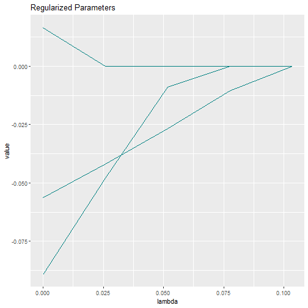
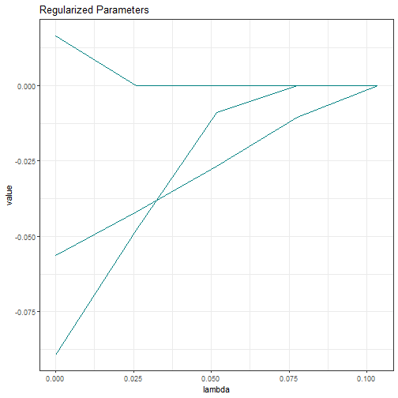

## Regularized Structural Equation Modeling

Regularized structural equation modeling has been proposed by Jacobucci et al. (2016)
and Huang et al. (2017). The objective is to reduce overfitting in small samples 
and to allow for more flexibility. The general idea is to push some parameters
towards zero. To this end, a penalty function $p(\pmb\theta)$ is added to the 
vanilla objective function. In lessSEM, this objective function is given by the
full information maximum likelihood function $F_{\text{ML}}(\pmb\theta)$. The new
objective function is defined as:

$$F_{\text{REGSEM},\lambda}(\pmb\theta) = F_{\text{ML}}(\pmb\theta)+ \lambda N p(\pmb\theta)$$

Think of this function as a tug-of-war:

* $F_{\text{ML}}(\pmb\theta)$ wants all parameters to be close to the ordinary 
maximum likelihood estimates
* $p(\pmb\theta)$ wants regularized parameters to be close to zero
* $\lambda$ allows us to fine tune which of the two forces mentioned above gets
more influence on the final parameter estimates
* $N$ is the sample size. Scaling with $N$ is done to stay consistent with results
returned by **regsem** and **lslx**.

There are many different penalty functions which could be used. In **lessSEM**,
we have implemented the following functions:

$$
\begin{array}{l|llll}
	\text{penalty} & \text{function} & \text{optimizer} & \text{reference}\\
	\hline
	\text{ridge} & p( x_j) = \lambda x_j^2 & \text{glmnet, ista} & \text{(Hoerl \& Kennard, 1970)}\\
	\text{lasso} & p( x_j) = \lambda| x_j| & \text{glmnet, ista} & \text{(Tibshirani, 1996)}\\
	\text{adaptiveLasso} & p( x_j) = \frac{1}{w_j}\lambda| x_j| & \text{glmnet, ista} & \text{(Zou, 2006)}\\
	\text{elasticNet} & p( x_j) = \alpha\lambda| x_j| + (1-\alpha)\lambda x_j^2 & \text{glmnet, ista} & \text{(Zou \& Hastie, 2005)}\\
	\text{cappedL1} & p( x_j) = \lambda \min(| x_j|, \theta); \theta > 0 &\text{glmnet, ista}& \text{(Zhang, 2010)}\\
	\text{lsp} & p( x_j) = \lambda \log(1 + |x_j|/\theta); \theta > 0 &\text{glmnet, ista}& \text{(Candès et al., 2008)} \\
	\text{scad} & p( x_j) = \begin{cases}
		\lambda |x_j| & \text{if } |x_j| \leq \lambda\\
		\frac{-x_j^2 + 2\theta\lambda |x_j| - \lambda^2}{2(\theta -1)} & \text{if } \lambda < |x_j| \leq \lambda\theta \\
		(\theta + 1) \lambda^2/2 & \text{if } |x_j| \geq \theta\lambda\\
	\end{cases}; \theta > 2 &\text{glmnet, ista}& \text{(Fan \& Li, 2001)} \\
	\text{mcp} & p( x_j) = 
	\begin{cases}
		\lambda |x_j| - x_j^2/(2\theta) & \text{if } |x_j| \leq \theta\lambda\\
		\theta\lambda^2/2 & \text{if } |x_j| > \lambda\theta
	\end{cases}; \theta > 0 &\text{glmnet, ista}& \text{(Zhang, 2010)}
\end{array}
$$

## Objectives

The objectives of **lessSEM** are to provide ...

1. a flexible framework for regularizing SEM.
2. optimizers for other packages that can handle non-differentiable penalty functions.

## Regularizing SEM

**lessSEM** is heavily inspired by the **regsem** package. It also builds on **lavaan**
to set up the model. 

### Setting up a model

First, start with lavaan:


```r
library(lavaan)
library(lessSEM)
set.seed(4321)
# let's simulate data for a simple 
# cfa with 7 observed variables
data <- lessSEM::simulateExampleData(N = 50, 
                                     loadings = c(rep(1,4),
                                                  rep(0,3))
)
head(data)
#>              y1         y2         y3         y4          y5         y6         y7
#> [1,] -0.1737175 -0.1970204  1.1888412  1.8520403  0.16257957  1.8825526  1.1383999
#> [2,] -1.5179940  0.9029781 -0.1726986 -0.3596920 -0.02092956 -0.5798953  0.9020861
#> [3,]  0.6136418  0.2578986 -0.1359237  0.7703602  0.23502463  0.2001872  0.7986506
#> [4,] -0.5920933  0.2157830  1.6784758  1.8568433 -0.60458482  0.2219578  0.4736751
#> [5,]  0.0763996 -1.1442382 -2.8122156  0.4899892  0.03453494  2.0457604 -2.6721417
#> [6,]  2.2504896  2.9742206  0.4353705  1.2338364  0.04693253 -0.6438847 -1.1386235

# we assume a single factor structure
lavaanSyntax <- "
      f =~ l1*y1 + l2*y2 + l3*y3 + l4*y4 + l5*y5 + l6*y6 + l7*y7 
      f ~~ 1*f
      "
# estimate the model with lavaan
lavaanModel <- cfa(lavaanSyntax, 
                   data = data)
```

Next, decide which parameters should be regularized. Let's
go with l5-l7. In **lessSEM**, we always use the parameter
labels to specify which parameters should be regularized!

```r
regularized <- c("l5", "l6", "l7")
# tip: we can use paste0 to make this easier:
regularized <- paste0("l", 5:7)
```

Finally, we set up the regularized model. To this end, we must
first decide which penalty function we want to use. If we want
to shrink parameters without setting them to zero, we can use 
ridge regularization. Otherwise, we must use any of the other
penalty functions mentioned above. In **lessSEM**, there is 
a dedicated function for each of these penalties. The names
of these functions are identical to the "penalty" column in the
table above. For instance, let's have a look at the lasso penalty:


```r
fitLasso <- lasso(lavaanModel = lavaanModel, 
                  regularized = regularized,
                  # please use much larger nLambdas in practice (e.g., 100)!
                  nLambdas = 5)
```


Plot the paths to see what is going on:


```r
plot(fitLasso)
```



Note that the parameters are pulled towards zero as $\lambda$ increases. Note also
that we did not specify specific values for $\lambda$ in the lasso function above.
Instead, we only specified how many $\lambda$s we want to have (`nLambdas=50`).
If we use the lasso or adaptive lasso, **lessSEM** can automatically compute 
which $\lambda$ is necessary to set all parameters to zero. This is currently
not supported for any of the other penalties. 

The plots returned by **lessSEM** are either **ggplot2** elements (in case of a single 
tuning parameter), or created with **plotly** (in case of 2 tuning parameters). You 
can change a plot post-hoc:


```r
plot(fitLasso) + 
  ggplot2::theme_bw()
```



The `coef` function gives access to all parameter estimates:


```r
coef(fitLasso)
#>                                                                                                                           
#>   Tuning         ||--||  Estimates                                                                                        
#>  ------- ------- ||--|| ---------- ---------- ---------- ---------- ---------- ---------- ---------- ---------- ----------
#>   lambda   alpha ||--||         l2         l3         l4         l5         l6         l7     y1~~y1     y2~~y2     y3~~y3
#>  ======= ======= ||--|| ========== ========== ========== ========== ========== ========== ========== ========== ==========
#>   0.1034  1.0000 ||--||     0.7523     0.7536     0.5742          .          .          .     0.8812     1.1477     1.9273
#>   0.0776  1.0000 ||--||     0.7477     0.7480     0.5720    -0.0104          .          .     0.8742     1.1523     1.9331
#>   0.0517  1.0000 ||--||     0.7399     0.7396     0.5688    -0.0266          .    -0.0090     0.8631     1.1602     1.9417
#>   0.0259  1.0000 ||--||     0.7301     0.7332     0.5677    -0.0418          .    -0.0478     0.8528     1.1706     1.9482
#>   0.0000  1.0000 ||--||     0.7239     0.7319     0.5688    -0.0562     0.0166    -0.0894     0.8491     1.1779     1.9496
#>                                             
#>                                             
#>  ---------- ---------- ---------- ----------
#>      y4~~y4     y5~~y5     y6~~y6     y7~~y7
#>  ========== ========== ========== ==========
#>      1.0804     0.5710     0.9628     1.5320
#>      1.0818     0.5705     0.9628     1.5320
#>      1.0838     0.5697     0.9628     1.5312
#>      1.0841     0.5689     0.9628     1.5282
#>      1.0830     0.5685     0.9626     1.5255
```
If you are only interested in the estimates, use

```r
estimates(fitLasso)
#>             l2        l3        l4          l5         l6           l7    y1~~y1   y2~~y2   y3~~y3   y4~~y4    y5~~y5    y6~~y6
#> [1,] 0.7522904 0.7536140 0.5742228  0.00000000 0.00000000  0.000000000 0.8812416 1.147737 1.927350 1.080353 0.5710041 0.9628056
#> [2,] 0.7476862 0.7480112 0.5720039 -0.01042497 0.00000000  0.000000000 0.8741617 1.152318 1.933141 1.081837 0.5704936 0.9628058
#> [3,] 0.7398991 0.7395932 0.5688300 -0.02660810 0.00000000 -0.008974807 0.8630783 1.160213 1.941722 1.083766 0.5696926 0.9628057
#> [4,] 0.7301019 0.7331646 0.5677000 -0.04181445 0.00000000 -0.047849804 0.8528254 1.170580 1.948163 1.084065 0.5689390 0.9628055
#> [5,] 0.7239003 0.7318701 0.5688230 -0.05624391 0.01658325 -0.089365627 0.8491201 1.177878 1.949609 1.082966 0.5684702 0.9625805
#>        y7~~y7
#> [1,] 1.531997
#> [2,] 1.532015
#> [3,] 1.531243
#> [4,] 1.528245
#> [5,] 1.525473
```

Now, let's assume you also want to try out the scad penalty. In this case, 
all you have to do is to replace the `lasso()` function with the `scad()` function:


```r
fitScad <- scad(lavaanModel = lavaanModel, 
                regularized = regularized,
                lambdas = seq(0,1,length.out = 4),
                thetas = seq(2.1, 5,length.out = 2))
```


The scad penalty has two tuning parmeters $\lambda$ and $\theta$. The naming follows
that used by Gong et al. (2013). We can plot the results again, however this requires
the **plotly** package and is currently not supported in Rmarkdown.


```r
plot(fitScad)
```

The parameter estimates can again be accessed with the `coef()` function:


```r
coef(fitScad)
#>                                                                                                                           
#>   Tuning         ||--||  Estimates                                                                                        
#>  ------- ------- ||--|| ---------- ---------- ---------- ---------- ---------- ---------- ---------- ---------- ----------
#>   lambda   theta ||--||         l2         l3         l4         l5         l6         l7     y1~~y1     y2~~y2     y3~~y3
#>  ======= ======= ||--|| ========== ========== ========== ========== ========== ========== ========== ========== ==========
#>   0.0000  2.1000 ||--||     0.7240     0.7320     0.5689    -0.0562     0.0166    -0.0894     0.8492     1.1778     1.9495
#>   0.3333  2.1000 ||--||     0.7523     0.7535     0.5742          .          .          .     0.8812     1.1478     1.9274
#>   0.6667  2.1000 ||--||     0.7522     0.7536     0.5742          .          .          .     0.8812     1.1478     1.9274
#>   1.0000  2.1000 ||--||     0.7522     0.7536     0.5742          .          .          .     0.8812     1.1478     1.9274
#>   0.0000  5.0000 ||--||     0.7242     0.7323     0.5690    -0.0562     0.0166    -0.0894     0.8495     1.1776     1.9493
#>   0.3333  5.0000 ||--||     0.7522     0.7535     0.5740          .          .          .     0.8811     1.1479     1.9275
#>   0.6667  5.0000 ||--||     0.7522     0.7535     0.5742          .          .          .     0.8811     1.1479     1.9274
#>   1.0000  5.0000 ||--||     0.7522     0.7535     0.5742          .          .          .     0.8811     1.1478     1.9275
#>                                             
#>                                             
#>  ---------- ---------- ---------- ----------
#>      y4~~y4     y5~~y5     y6~~y6     y7~~y7
#>  ========== ========== ========== ==========
#>      1.0829     0.5684     0.9626     1.5255
#>      1.0804     0.5710     0.9628     1.5320
#>      1.0804     0.5710     0.9628     1.5320
#>      1.0804     0.5710     0.9628     1.5320
#>      1.0829     0.5684     0.9626     1.5255
#>      1.0805     0.5711     0.9628     1.5320
#>      1.0804     0.5710     0.9628     1.5320
#>      1.0804     0.5710     0.9628     1.5320
```

### Selecting a model

To select a model and report the final parameter estimates, you can use the 
AIC or BIC. There are two ways to use these information criteria.

First, you can compute them and select the model yourself:


```r
AICs <- AIC(fitLasso)
head(AICs)
#>       lambda alpha objectiveValue regObjectiveValue     m2LL  regM2LL nonZeroParameters convergence      AIC
#> 1 0.10340887     1       1071.078          1071.078 1071.078 1071.078                10        TRUE 1091.078
#> 2 0.07755666     1       1071.033          1071.074 1071.033 1071.074                11        TRUE 1093.033
#> 3 0.05170444     1       1070.956          1071.048 1070.956 1071.048                12        TRUE 1094.956
#> 4 0.02585222     1       1070.851          1070.967 1070.851 1070.967                12        TRUE 1094.851
#> 5 0.00000000     1       1070.810          1070.810 1070.810 1070.810                13        TRUE 1096.810

fitLasso@parameters[which.min(AICs$AIC),]
#>      lambda alpha        l2       l3        l4 l5 l6 l7    y1~~y1   y2~~y2  y3~~y3   y4~~y4    y5~~y5    y6~~y6   y7~~y7
#> 1 0.1034089     1 0.7522904 0.753614 0.5742228  0  0  0 0.8812416 1.147737 1.92735 1.080353 0.5710041 0.9628056 1.531997
```

An easier way is to use the `coef()` function again:


```r
coef(fitLasso, criterion = "AIC")
#>                                                                                                                           
#>   Tuning         ||--||  Estimates                                                                                        
#>  ------- ------- ||--|| ---------- ---------- ---------- ---------- ---------- ---------- ---------- ---------- ----------
#>   lambda   alpha ||--||         l2         l3         l4         l5         l6         l7     y1~~y1     y2~~y2     y3~~y3
#>  ======= ======= ||--|| ========== ========== ========== ========== ========== ========== ========== ========== ==========
#>   0.1034  1.0000 ||--||     0.7523     0.7536     0.5742          .          .          .     0.8812     1.1477     1.9273
#>                                             
#>                                             
#>  ---------- ---------- ---------- ----------
#>      y4~~y4     y5~~y5     y6~~y6     y7~~y7
#>  ========== ========== ========== ==========
#>      1.0804     0.5710     0.9628     1.5320
```

Alternatively, you can extract just the estimates with:

```r
estimates(fitLasso, criterion = "AIC")
#>             l2       l3        l4 l5 l6 l7    y1~~y1   y2~~y2  y3~~y3   y4~~y4    y5~~y5    y6~~y6   y7~~y7
#> [1,] 0.7522904 0.753614 0.5742228  0  0  0 0.8812416 1.147737 1.92735 1.080353 0.5710041 0.9628056 1.531997
```

#### Cross-Validation

A very good alternative to information criteria is the use of cross-validation.
In **lessSEM**, there is a dedicated cross-validation function for each of the 
penalties discussed above. Let's look at the `lsp()` penalty this time. Now,
for your non-cross-validated lsp, you would use


```r
fitLsp <- lsp(lavaanModel = lavaanModel, 
              regularized = regularized,
              lambdas = seq(0,1,.1),
              thetas = seq(.1,2,length.out = 4))
```

To use a cross-validated version of the lsp, simply use the `cv` prefix. The function
is called `cvLsp()`:


```r
fitCvLsp <- cvLsp(lavaanModel = lavaanModel, 
                  regularized = regularized,
                  lambdas = seq(0,1,.1),
                  thetas = seq(.1,2,length.out = 4))
```

The best model can now be accessed with 

```r
coef(fitCvLsp)
#>                                                                                                                           
#>   Tuning         ||--||  Estimates                                                                                        
#>  ------- ------- ||--|| ---------- ---------- ---------- ---------- ---------- ---------- ---------- ---------- ----------
#>   lambda   theta ||--||         l2         l3         l4         l5         l6         l7     y1~~y1     y2~~y2     y3~~y3
#>  ======= ======= ||--|| ========== ========== ========== ========== ========== ========== ========== ========== ==========
#>   1.0000  0.1000 ||--||     0.7523     0.7536     0.5742          .          .          .     0.8813     1.1477     1.9273
#>                                             
#>                                             
#>  ---------- ---------- ---------- ----------
#>      y4~~y4     y5~~y5     y6~~y6     y7~~y7
#>  ========== ========== ========== ==========
#>      1.0804     0.5710     0.9628     1.5320
```

### Missing Data

Most psychological data sets will have missing data. In **lessSEM**, we use the
full information maximum likelihood function
to account for this missingness. **lessSEM** expects
that you already use the full information maximum likelihood method in **lavaan**.


```r
# let's simulate data for a simple 
# cfa with 7 observed variables
# and 10 % missing data
data <- lessSEM::simulateExampleData(N = 100, 
                                     loadings = c(rep(1,4),
                                                  rep(0,3)),
                                     percentMissing = 10
)
head(data)
#>               y1         y2         y3          y4         y5        y6         y7
#> [1,]  0.60367543 -0.3206755 -0.5712115  0.36626658  0.6138552 0.8207451  0.6346473
#> [2,]  0.37497661  2.0100766 -1.5925242 -0.02983920  0.2409065 1.1250778  0.8865902
#> [3,]          NA  0.8134143  1.7803075  3.27710938 -0.3651732        NA -0.8283463
#> [4,] -0.04379503  0.1369219 -1.9424719  0.40304282 -0.6435542 1.5412868  0.0635044
#> [5,] -0.32969221         NA -1.6536493 -2.20991516  1.2462449 0.6725163         NA
#> [6,]  0.61738032  0.9116425  0.9196841  0.03340633  0.5553805 0.1209500  2.0956358

# we assume a single factor structure
lavaanSyntax <- "
      f =~ l1*y1 + l2*y2 + l3*y3 + l4*y4 + l5*y5 + l6*y6 + l7*y7 
      f ~~ 1*f
      "
# estimate the model with lavaan
lavaanModel <- cfa(lavaanSyntax, 
                   data = data,
                   missing = "ml") # important: use fiml for missing data
```

Note that we added the argument `missing = 'ml'` to the **lavaan** model.
This tells **lavaan** to use the full information maximum likelihood function.

Next, pass this model to any of the penalty functions in **lessSEM**. **lessSEM**
will automatically switch to the full information maximum likelihood function 
as well:


```r
fitLasso <- lasso(lavaanModel = lavaanModel, 
                  regularized = regularized,
                  nLambdas = 10)
```

To check if **lessSEM** did actually use the full information maximum
likelihood, we can compare the 2log-likelihood of **lavaan** and **lessSEM**
when no penalty is used ($\lambda = 0$):


```r
fitLasso <- lasso(lavaanModel = lavaanModel, 
                  regularized = regularized,
                  lambdas = 0)
```

```r
fitLasso@fits$m2LL
#> [1] 2034.104
```


Compare this to:

```r
-2*logLik(lavaanModel)
#> 'log Lik.' 2034.104 (df=20)
```

## Using multiple cores

By default, **lessSEM** will only use one computer core. However,
if a model has many parameters, parallel computations can be faster.
Multi-Core support is therefore provided using the **RcppParallel** package (Allaire et. al, 2023).
To make use of multiple cores, the number of cores must be specified in the
`control` argument (see below). Before doing that, it makes sense to check how
many cores the computer has:


```r
library(RcppParallel)
# Print the number of threads (we call them cores for simplicity, but technically they are threads)
RcppParallel::defaultNumThreads()
#> [1] 16
```
Note that using all cores can block the computer because there are no resources
left for other tasks than R. To use 2 cores, we can set `nCores = 2` as follows:


```r
fitLasso <- lasso(lavaanModel = lavaanModel, 
                  regularized = regularized,
                  nLambdas = 10,
                  control = controlGlmnet(nCores = 2))
```

Note that multi-core support is only provided for SEM. Using the optimizers implemented
in **lessSEM** for models other than SEM (e.g., in the [**lessLM**](https://github.com/jhorzek/lessLM) 
package) will not automatically allow for multi-core execution.

## Changing the optimizer

**lessSEM** comes with two specialized optimization procedures: ista and glmnet.
Currently, the default is glmnet for all penalties.
Ista does not require the computation of a Hessian matrix. 
However, this comes at a price: ista optimization
tends to call the fit and gradient function a lot more than glment. We recommend that you 
first test the glmnet optimizer and then switch to ista if glmnet results in errors
due to the Hessian matrix. Switching to ista is done as follows:


```r
fitLasso <- lasso(lavaanModel = lavaanModel, 
                  regularized = regularized,
                  nLambdas = 10,
                  method = "ista", # change the method
                  control = controlIsta() # change the control argument
                  )
```

## Parameter transformations

**lessSEM** allows for parameter transformations. This is explained in detail in the
vignette Parameter-transformations (see `vignette("Parameter-transformations", package = "lessSEM")`).
To provide a short example, let's have a look at the political democracy data set:


```r
# example from ?lavaan::sem
library(lavaan)
modelSyntax <- ' 
  # latent variable definitions
     ind60 =~ x1 + x2 + x3
     dem60 =~ y1 + a*y2 + b*y3 + c*y4
     dem65 =~ y5 + a*y6 + b*y7 + c*y8

  # regressions
    dem60 ~ ind60
    dem65 ~ ind60 + dem60

  # residual correlations
    y1 ~~ y5
    y2 ~~ y4 
    y3 ~~ y7
    y4 ~~ y8
    y6 ~~ y8
'

lavaanFit <- sem(model = modelSyntax,
                 data = PoliticalDemocracy)
```

Note that in the model estimated above, loadings on the latent variables are 
constrained to equality over time. We could also relax this assumption by
allowing for time point specific loadings:


```r
library(lavaan)
modelSyntax <- ' 
  # latent variable definitions
     ind60 =~ x1 + x2 + x3
     dem60 =~ y1 + a1*y2 + b1*y3 + c1*y4
     dem65 =~ y5 + a2*y6 + b2*y7 + c2*y8

  # regressions
    dem60 ~ ind60
    dem65 ~ ind60 + dem60

  # residual correlations
    y1 ~~ y5
    y2 ~~ y4 
    y3 ~~ y7
    y4 ~~ y8
    y6 ~~ y8
'

lavaanFit <- sem(model = modelSyntax,
                 data = PoliticalDemocracy)
```

Deciding between both approaches can be difficult as there may be some parameters
for which equality over time holds, while others violate the assumption. 
Here, transformations can be used to regularize differences between parameters.
To this end, we define the transformations:


```r
transformations <- "
// IMPORTANT: Our transformations always have to start with the follwing line:
parameters: a1, a2, b1, b2, c1, c2, delta_a2, delta_b2, delta_c2

// In the line above, we defined the names of the parameters which we
// want to use in our transformations. EACH AND EVERY PARAMETER USED IN
// THE FOLLOWING MUST BE STATED ABOVE. The line must always start with
// the keyword 'parameters' followed by a colon. The parameters must be
// separated by commata.
// Comments are added with double-backslash

// Now we can state our transformations:

a2 = a1 + delta_a2; // statements must end with semicolon
b2 = b1 + delta_b2;
c2 = c1 + delta_c2;
"
```

Next, we have to pass the `transformations` variable to the penalty function:


```r
lassoFit <- lasso(lavaanModel = lavaanFit, 
                  regularized = c("delta_a2", "delta_b2", "delta_c2"),# we want to regularize 
                  # the differences between the parameters
                  nLambdas = 100,
                  # Our model modification must make use of the modifyModel - function:
                  modifyModel = modifyModel(transformations = transformations)
)
```


To check if measurement invariance can be assumed, we can select the best model 
using information criteria:


```r
coef(lassoFit, criterion = "BIC")
#>                                                                                                                              
#>   Tuning         ||--||  Estimates                                                                                           
#>  ------- ------- ||--|| ---------- ---------- ---------- ---------- ---------- ----------- ----------- ----------- ----------
#>   lambda   alpha ||--||  ind60=~x2  ind60=~x3         a1         b1         c1 dem60~ind60 dem65~ind60 dem65~dem60     y1~~y5
#>  ======= ======= ||--|| ========== ========== ========== ========== ========== =========== =========== =========== ==========
#>   0.2216  1.0000 ||--||     2.1825     1.8189     1.2110     1.1679     1.2340      1.4534      0.5935      0.8659     0.5552
#>                                                                                                                          
#>                                                                                                                          
#>  ---------- ---------- ---------- ---------- ---------- ---------- ---------- ---------- ---------- ---------- ----------
#>      y2~~y4     y3~~y7     y4~~y8     y6~~y8     x1~~x1     x2~~x2     x3~~x3     y1~~y1     y2~~y2     y3~~y3     y4~~y4
#>  ========== ========== ========== ========== ========== ========== ========== ========== ========== ========== ==========
#>      1.5947     0.7807     0.6537     1.5350     0.0820     0.1177     0.4675     1.7929     7.3843     5.0175     3.4074
#>                                                                                                                            
#>                                                                                                                      ||--||
#>  ---------- ---------- ---------- ---------- ------------ ------------ ------------ ---------- ---------- ---------- ||--||
#>      y5~~y5     y6~~y6     y7~~y7     y8~~y8 ind60~~ind60 dem60~~dem60 dem65~~dem65   delta_a2   delta_b2   delta_c2 ||--||
#>  ========== ========== ========== ========== ============ ============ ============ ========== ========== ========== ||--||
#>      2.2857     4.8977     3.5510     3.4511       0.4480       3.9408       0.2034          .          .          . ||--||
#>                                  
#>   Transform                      
#>  ---------- ---------- ----------
#>          a2         b2         c2
#>  ========== ========== ==========
#>      1.2110     1.1679     1.2340
```

More details are provided in `vignette("Parameter-transformations", package = "lessSEM")`.

# Experimental Features

The following features are relatively new and you may still experience some bugs.
Please be aware of that when using these features.

## From **lessSEM** to **lavaan**

**lessSEM** supports exporting specific models to **lavaan**. This can be very useful when plotting the 
final model. 

```r
lavaanModel <- lessSEM2Lavaan(regularizedSEM = rsem, 
                              criterion = "BIC")
```

The result can be plotted with, for instance, [**semPlot**](https://github.com/SachaEpskamp/semPlot):

```r
library(semPlot)
semPaths(lavaanModel,
         what = "est",
         fade = FALSE)
```

## Multi-Group Models and Definition Variables

**lessSEM** supports multi-group SEM and, to some degree, definition variables.
Regularized multi-group SEM have been proposed by Huang (2018) and are 
implemented in **lslx** (Huang, 2020). Here, differences between groups are regularized.
A detailed introduction can be found in 
`vignette(topic = "Definition-Variables-and-Multi-Group-SEM", package = "lessSEM")`.
Therein it is also explained how the multi-group SEM can be used to implement
definition variables (e.g., for latent growth curve models).

## Mixed Penalties

**lessSEM** allows for defining different penalties for different parts
of the model. This feature is new and very experimental. Please keep that
in mind when using the procedure. A detailed introduction
can be found in `vignette(topic = "Mixed-Penalties", package = "lessSEM")`.

To provide a short example, we will regularize the loadings and the regression
parameters of the Political Democracy data set with different penalties. The 
following script is adapted from `?lavaan::sem`.


```r
model <- ' 
  # latent variable definitions
     ind60 =~ x1 + x2 + x3 + c2*y2 + c3*y3 + c4*y4
     dem60 =~ y1 + y2 + y3 + y4
     dem65 =~ y5 + y6 + y7 + c*y8

  # regressions
    dem60 ~ r1*ind60
    dem65 ~ r2*ind60 + r3*dem60
'

lavaanModel <- sem(model,
                   data = PoliticalDemocracy)

# Let's add a lasso penalty on the cross-loadings c2 - c4 and 
# scad penalty on the regressions r1-r3
mp <- lavaanModel |>
  mixedPenalty() |>
  addLasso(regularized = c("c2", "c3", "c4"), 
           lambdas = seq(0,1,.1)) |>
  addLasso(regularized = c("r1", "r2", "r3"), 
           lambdas = seq(0,1,.2)) |>
  fit()
```

The best model according to the BIC can be extracted with:


```r
coef(fitMp, criterion = "BIC")
```

# More information

We provide more information in the documentation of the individual functions.
For instance, see `?lessSEM::lasso` for more details on the lasso penalty. If you
are interested in the general purpose interface, have a look at `?lessEM::gpLasso`,
`?lesssEM::gpMcp`, etc. To get more details on implementing the **lessSEM** optimizers in
your own package, have a look at the vignettes `vignette('General-Purpose-Optimization')` and 
`vignette('The-optimizer-interface')` and at the [**lessLM**](https://github.com/jhorzek/lessLM) package.

# References

## R - Packages / Software

* [lavaan](https://github.com/yrosseel/lavaan) Rosseel, Y. (2012). lavaan: An R Package for Structural Equation Modeling. Journal of Statistical Software, 48(2), 1–36. https://doi.org/10.18637/jss.v048.i02
* [regsem](https://github.com/Rjacobucci/regsem): Jacobucci, R. (2017). regsem: 
Regularized Structural Equation Modeling. ArXiv:1703.08489 [Stat]. https://arxiv.org/abs/1703.08489
* [lslx](https://github.com/psyphh/lslx): Huang, P.-H. (2020). lslx: 
Semi-confirmatory structural equation modeling via penalized likelihood. Journal 
of Statistical Software, 93(7). https://doi.org/10.18637/jss.v093.i07
* [fasta](https://cran.r-project.org/package=fasta): 
Another implementation of the fista algorithm (Beck & Teboulle, 2009)
* [ensmallen](https://ensmallen.org/): Curtin, R. R., Edel, M., Prabhu, R. G., 
Basak, S., Lou, Z., & Sanderson, C. (2021). The ensmallen library for flexible 
numerical optimization. Journal of Machine Learning Research, 22, 1–6.
* [RcppParallel](https://rcppcore.github.io/RcppParallel/) Allaire J, Francois R, Ushey K, Vandenbrouck G, Geelnard M, Intel (2023). _RcppParallel: Parallel Programming Tools for 'Rcpp'_. R package version 5.1.6, <https://CRAN.R-project.org/package=RcppParallel>.

## Regularized Structural Equation Modeling

* Huang, P.-H., Chen, H., & Weng, L.-J. (2017). A Penalized Likelihood Method 
for Structural Equation Modeling. Psychometrika, 82(2), 329–354. https://doi.org/10.1007/s11336-017-9566-9
* Huang, P.-H. (2018). A penalized likelihood method for multi-group structural equation modelling. British Journal of Mathematical and Statistical Psychology, 71(3), 499–522. https://doi.org/10.1111/bmsp.12130
* Jacobucci, R., Grimm, K. J., & McArdle, J. J. (2016). Regularized Structural 
Equation Modeling. Structural Equation Modeling: A Multidisciplinary Journal, 23(4), 
555–566. https://doi.org/10.1080/10705511.2016.1154793

## Penalty Functions

* Candès, E. J., Wakin, M. B., & Boyd, S. P. (2008). Enhancing Sparsity by 
Reweighted l1 Minimization. Journal of Fourier Analysis and Applications, 14(5–6), 
877–905. https://doi.org/10.1007/s00041-008-9045-x
* Fan, J., & Li, R. (2001). Variable selection via nonconcave penalized 
likelihood and its oracle properties. Journal of the American Statistical 
Association, 96(456), 1348–1360. https://doi.org/10.1198/016214501753382273
* Hoerl, A. E., & Kennard, R. W. (1970). Ridge Regression: Biased Estimation 
for Nonorthogonal Problems. Technometrics, 12(1), 55–67. https://doi.org/10.1080/00401706.1970.10488634
* Tibshirani, R. (1996). Regression shrinkage and selection via the lasso. 
Journal of the Royal Statistical Society. Series B (Methodological), 58(1), 267–288.
* Zhang, C.-H. (2010). Nearly unbiased variable selection under minimax concave penalty. 
The Annals of Statistics, 38(2), 894–942. https://doi.org/10.1214/09-AOS729
* Zhang, T. (2010). Analysis of Multi-stage Convex Relaxation for Sparse Regularization. 
Journal of Machine Learning Research, 11, 1081–1107.
* Zou, H. (2006). The adaptive lasso and its oracle properties. Journal of the 
American Statistical Association, 101(476), 1418–1429. https://doi.org/10.1198/016214506000000735
* Zou, H., & Hastie, T. (2005). Regularization and variable selection via the 
elastic net. Journal of the Royal Statistical Society: Series B, 67(2), 301–320. 
https://doi.org/10.1111/j.1467-9868.2005.00503.x

## Optimizer

### GLMNET 

* Friedman, J., Hastie, T., & Tibshirani, R. (2010). Regularization paths for 
generalized linear models via coordinate descent. Journal of Statistical 
Software, 33(1), 1–20. https://doi.org/10.18637/jss.v033.i01
* Yuan, G.-X., Ho, C.-H., & Lin, C.-J. (2012). An improved GLMNET for 
l1-regularized logistic regression. The Journal of Machine Learning Research, 
13, 1999–2030. https://doi.org/10.1145/2020408.2020421

### Variants of ISTA

* Beck, A., & Teboulle, M. (2009). A Fast Iterative Shrinkage-Thresholding 
Algorithm for Linear Inverse Problems. SIAM Journal on Imaging Sciences, 2(1), 
183–202. https://doi.org/10.1137/080716542
* Gong, P., Zhang, C., Lu, Z., Huang, J., & Ye, J. (2013). A general iterative 
shrinkage and thresholding algorithm for non-convex regularized optimization problems. 
Proceedings of the 30th International Conference on Machine Learning, 28(2)(2), 37–45.
* Parikh, N., & Boyd, S. (2013). Proximal Algorithms. Foundations and 
Trends in Optimization, 1(3), 123–231.


# LICENSE NOTE

THE SOFTWARE IS PROVIDED 'AS IS', WITHOUT WARRANTY OF ANY KIND, EXPRESS OR IMPLIED, 
INCLUDING BUT NOT LIMITED TO THE WARRANTIES OF MERCHANTABILITY, 
FITNESS FOR A PARTICULAR PURPOSE AND NONINFRINGEMENT. IN NO EVENT SHALL THE 
AUTHORS OR COPYRIGHT HOLDERS BE LIABLE FOR ANY CLAIM, DAMAGES OR OTHER LIABILITY, 
WHETHER IN AN ACTION OF CONTRACT, TORT OR OTHERWISE, ARISING FROM, OUT OF OR IN 
CONNECTION WITH THE SOFTWARE OR THE USE OR OTHER DEALINGS IN THE SOFTWARE. 


